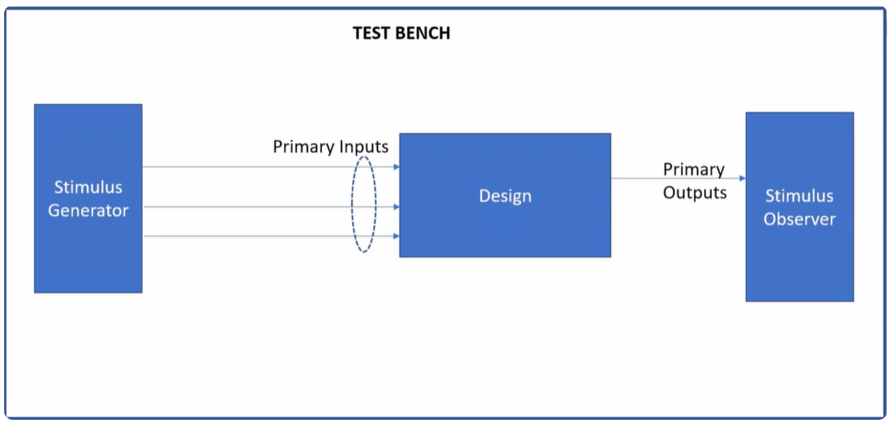
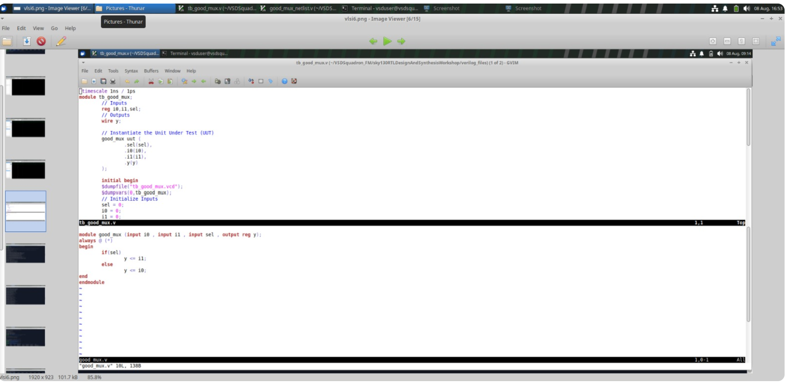
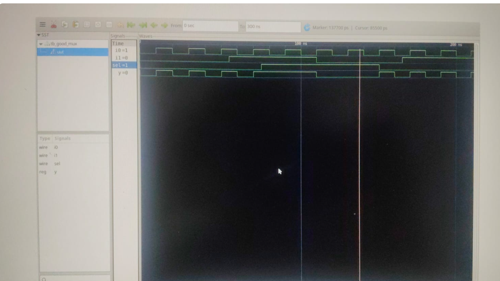
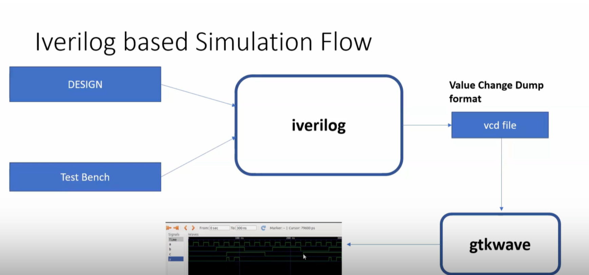
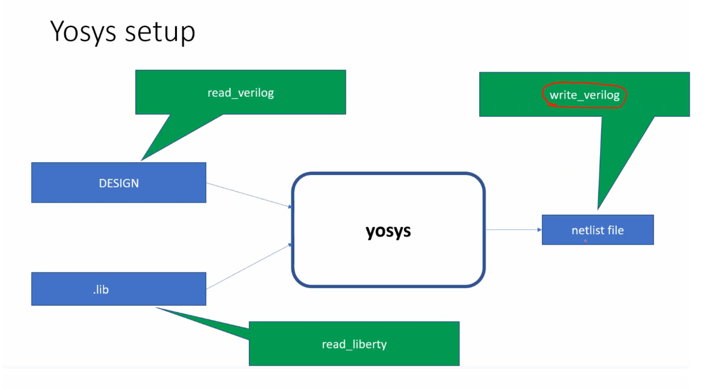
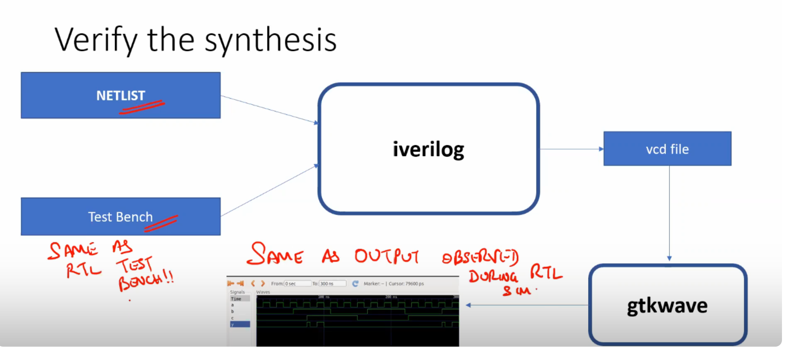

# Module 01 — Building the First RTL-to-Netlist Flow

## 1. Introduction

The first step in digital design is learning how a hardware description travels through a complete development flow. Writing a Verilog module is only one part of the process. The design must also be stimulated, simulated, inspected and synthesized before a hardware-oriented representation can be studied.

This module uses a small 2:1 multiplexer as the design-under-test. Although the circuit is simple, the same basic flow is used for much larger digital blocks.

The complete path explored in this module is:

```text
RTL Source
   |
   v
Testbench
   |
   v
Compilation and Simulation
   |
   v
VCD Generation
   |
   v
GTKWave Inspection
   |
   v
Yosys Synthesis
   |
   v
Technology Mapping
   |
   v
Gate-Level Netlist
```

## 2. Objectives

The goals of this module are to understand:

- how a combinational circuit is described in Verilog
- the difference between a DUT and a testbench
- how Icarus Verilog compiles and runs a simulation
- why a VCD file is generated
- how GTKWave is used to inspect timing relationships
- how Yosys reads RTL and creates an internal logic representation
- how a Liberty file provides technology information
- how generic logic can be mapped to SKY130 cells
- how a synthesized netlist differs from the original RTL

## 3. The Design Under Test

A 2:1 multiplexer selects one of two input signals.

The logical behavior is:

```text
              sel = 0
i0 --------------------------+
                             |
                             v
                           output y

              sel = 1
i1 --------------------------+
```

The truth table is:

| `sel` | `y` |
|---|---|
| 0 | `i0` |
| 1 | `i1` |

This is a good first example because it contains input data, a control signal and a directly observable output.

## 4. RTL Description

One procedural implementation is:

```verilog
module good_mux (
    input i0,
    input i1,
    input sel,
    output reg y
);

always @(*) begin
    if (sel)
        y <= i1;
    else
        y <= i0;
end

endmodule
```

The `if` statement describes the selection behavior. When `sel` is asserted, the second input is chosen; otherwise the first input is selected.

The use of `always @(*)` indicates that the block represents combinational behavior and should react when the signals used in the block change.


## 5. Testbench Construction

The testbench is not intended to become hardware. Its purpose is to generate input activity and observe the response of the DUT.

A simple testbench can be written as:

```verilog
`timescale 1ns / 1ps

module tb_good_mux;

reg i0;
reg i1;
reg sel;
wire y;

good_mux dut (
    .i0(i0),
    .i1(i1),
    .sel(sel),
    .y(y)
);

initial begin
    $dumpfile("tb_good_mux.vcd");
    $dumpvars(0, tb_good_mux);

    i0 = 0;
    i1 = 0;
    sel = 0;

    #300 $finish;
end

always #10 i0  = ~i0;
always #55 i1  = ~i1;
always #75 sel = ~sel;

endmodule
```

Different toggle periods are useful because they create a changing combination of input states. The output can then be checked over many different situations.

## 6. Simulation with Icarus Verilog

A typical command sequence is:

```bash
iverilog good_mux.v tb_good_mux.v
./a.out
```

The first command compiles the Verilog files. The generated executable runs the testbench. During execution, the `$dumpfile` and `$dumpvars` system tasks create a waveform database.

Depending on local preferences, an explicit output file can also be used:

```bash
iverilog -o mux_sim good_mux.v tb_good_mux.v
./mux_sim
```

After simulation, confirm that the VCD file was created.

## 7. Understanding the VCD File

VCD stands for Value Change Dump. The file records changes in simulation signals over time.

It can contain information associated with signals such as:

```text
i0
i1
sel
y
```

The raw file is not usually the easiest way to understand circuit behavior, so it is commonly opened in a waveform viewer.



## 8. Waveform Analysis with GTKWave

Launch the viewer with:

```bash
gtkwave tb_good_mux.vcd
```

Add the input and output signals to the waveform window.

The main verification questions are:

1. When `sel = 0`, does `y` follow `i0`?
2. When `sel = 1`, does `y` follow `i1`?
3. When the selected input changes, does the output change according to the RTL behavior?
4. Does the output ignore changes on the currently unselected input?

The purpose of waveform analysis is not simply to confirm that signals are toggling. It is to check the relationship between the signals.

## 9. RTL Simulation Flow

The simulation stage can be summarized as:

```text
        DUT RTL
           |
           |
Testbench stimulus
           |
           v
       Simulator
           |
           v
        VCD file
           |
           v
       GTKWave
           |
           v
   Functional inspection
```

At this point, the design is still being verified at the RTL level.

## 10. Introduction to Yosys

Yosys is used to process the Verilog description for synthesis.

The synthesis process can be viewed as:

```text
Verilog RTL
    |
    v
Parsing
    |
    v
Internal representation
    |
    v
Logic analysis
    |
    v
Optimization
    |
    v
Mapped implementation
```

The source code itself is not copied line-by-line into a netlist. The tool analyzes the described behavior and constructs a hardware representation.

## 11. Generic Logic and Technology Mapping

Before mapping, logic can be represented in a technology-independent form.

Technology mapping connects the design to cells available in a selected library:

```text
RTL
 |
 v
Generic logic
 |
 v
Optimization
 |
 v
Available library cells
 |
 v
Technology-mapped netlist
```

This step is important because real implementation uses a particular technology and its available standard cells.

## 12. Liberty Files

A Liberty file generally uses the `.lib` extension. It contains characterization information about standard cells.

The information may describe:

- logical functionality
- pin directions
- timing behavior
- timing arcs
- delay values
- area
- power-related properties
- drive capability
- operating conditions

A synthesis tool can use this information while selecting cells for the design.

## 13. SKY130 Technology Mapping

The SKY130 ecosystem provides standard-cell libraries that can be used in open-source design flows.

A representative Yosys sequence is:

```yosys
read_liberty -lib /path/to/library.lib
read_verilog good_mux.v
synth -top good_mux
abc -liberty /path/to/library.lib
show
write_verilog -noattr good_mux_netlist.v
```

The library path must match the local installation.

After synthesis, inspect the generated netlist and compare its structure with the original RTL.

## 14. Suggested Checks

Before considering the experiment complete, verify the following:

### Simulation checks

- The RTL compiles successfully.
- The testbench starts with known input values.
- The VCD file is generated.
- The waveform shows all expected transitions.
- The output follows the multiplexer truth table.

### Synthesis checks

- Yosys reads the RTL successfully.
- The intended top module is selected.
- Synthesis completes.
- Technology mapping uses the intended library.
- A structural Verilog netlist is generated.

## 15. Common Problems

### VCD file is missing

Check that `$dumpfile` and `$dumpvars` are present and that the simulation actually reaches the relevant statements.

### Output does not match the selected input

Check the DUT port connections and the selector logic.

### Yosys cannot find the library

Verify the local path to the `.lib` file.

### Wrong top module

Use the correct module name with:

```yosys
synth -top good_mux
```

## 16. Module Conclusion

This module establishes the foundation used throughout the remaining modules.

The key flow is:

```text
Write RTL
    |
    v
Create testbench
    |
    v
Simulate
    |
    v
Inspect waveform
    |
    v
Synthesize
    |
    v
Map to technology
    |
    v
Inspect netlist
```

A simple MUX is enough to demonstrate the complete chain from behavioral hardware description to a technology-aware implementation.

## 17. File Organization

A practical project should separate design files from verification files.

A simple arrangement is:

```text
module_01/
├── rtl/
│   └── good_mux.v
├── tb/
│   └── tb_good_mux.v
├── sim/
│   └── tb_good_mux.vcd
├── synth/
│   └── good_mux_netlist.v
└── README.md
```

This organization makes it easier to identify which files describe hardware and which files are used only for simulation.

## 18. RTL File Versus Testbench File

The DUT file contains synthesizable design logic.

The testbench normally contains simulation-only constructs such as:

```verilog
initial
always #10
$dumpfile
$dumpvars
$finish
```

These statements are useful for verification but are not intended to become physical gates.

This distinction is important:

```text
Design RTL
    |
    +--> may become hardware

Testbench
    |
    +--> stimulates and observes the design
```

## 19. Why a Small MUX Is Useful

A MUX is simple enough to understand completely but still demonstrates several important ideas.

It contains:

- input data paths
- a selection control
- an output
- combinational behavior
- testbench stimulus
- synthesis inference
- technology mapping

The same reasoning can later be applied to larger blocks.

## 20. Functional Coverage of the MUX

For a 2:1 MUX, the selector has only two states.

When:

```text
sel = 0
```

the expected relationship is:

```text
y = i0
```

When:

```text
sel = 1
```

the expected relationship is:

```text
y = i1
```

A useful manual verification table is:

| i0 | i1 | sel | Expected y |
|---:|---:|----:|-----------:|
| 0 | 0 | 0 | 0 |
| 0 | 1 | 0 | 0 |
| 1 | 0 | 0 | 1 |
| 1 | 1 | 0 | 1 |
| 0 | 0 | 1 | 0 |
| 0 | 1 | 1 | 1 |
| 1 | 0 | 1 | 0 |
| 1 | 1 | 1 | 1 |

This table gives complete logical coverage for the single-bit MUX.

## 21. Stimulus Timing

A testbench can use different delays for different signals:

```verilog
always #10 i0  = ~i0;
always #55 i1  = ~i1;
always #75 sel = ~sel;
```

The non-identical periods create different combinations of input changes.

The purpose is to avoid testing only one repetitive pattern.

## 22. Reading Waveforms Correctly

When examining a waveform, first locate the selector.

Then determine which input should control the output.

For example:

```text
sel = 0
```

means the waveform of `y` should match `i0`.

If the selector changes:

```text
sel: 0 -> 1
```

the output should begin following `i1`.

Waveform reading should therefore be based on expected relationships rather than visual similarity alone.

## 23. Simulation Failure Checklist

If the simulation fails, check the following in order:

1. Is the DUT module name correct?
2. Are all ports connected?
3. Is the testbench top module selected?
4. Are initial values assigned?
5. Does the simulation reach `$finish`?
6. Is the VCD dump enabled?
7. Are the correct signals displayed?

A systematic checklist avoids repeatedly changing unrelated code.

## 24. Synthesis Failure Checklist

For synthesis problems:

1. confirm the RTL syntax
2. confirm the top module
3. check the library path
4. check the library format
5. inspect tool warnings
6. verify that the output file is created
7. inspect the synthesized structure

## 25. Generic Netlist Interpretation

A synthesized design may no longer look like:

```verilog
assign y = sel ? i1 : i0;
```

Instead, it may contain explicit logic cells and connections.

The important question is not:

```text
Does the netlist look like the source?
```

The better question is:

```text
Does the netlist implement the same required function?
```

## 26. Technology Mapping Trade-Offs

Technology mapping can be influenced by implementation goals.

Possible goals include:

- lower area
- improved timing
- reduced switching activity
- use of available cells
- balanced resource usage

Therefore, two synthesis configurations can potentially produce different structural netlists for the same RTL.

## 27. Reproducibility

A GitHub project should document the commands used.

For example:

```text
Compile:
iverilog ...

Run:
./a.out

View:
gtkwave ...

Synthesize:
yosys ...
```

The exact library paths should be documented for the local environment.

## 28. Experiment Record

A useful lab record can include:

| Item | Result |
|---|---|
| RTL compilation | Pass/Fail |
| Simulation | Pass/Fail |
| VCD generated | Yes/No |
| Waveform checked | Yes/No |
| Synthesis | Pass/Fail |
| Technology mapping | Pass/Fail |
| Netlist generated | Yes/No |

This makes the repository easier for another student to reproduce.

## 29. What This Module Teaches

The most important lessons are:

```text
RTL is the starting point.
Simulation checks intended behavior.
Waveforms expose signal relationships.
Synthesis creates an implementation.
Libraries describe available technology.
Mapping connects logic to physical cell choices.
```

## 30. Extended Summary

The first module should be viewed as the foundation for the entire repository.

A designer does not move directly from Verilog to silicon. There are intermediate representations and verification stages.

The basic learning sequence is:

```text
Understand the function
        |
        v
Describe the function in RTL
        |
        v
Create stimulus
        |
        v
Run simulation
        |
        v
Inspect waveforms
        |
        v
Run synthesis
        |
        v
Study implementation
```

Once this flow is familiar, later modules can focus on the more subtle effects of synthesis, timing libraries, optimization and coding style.
