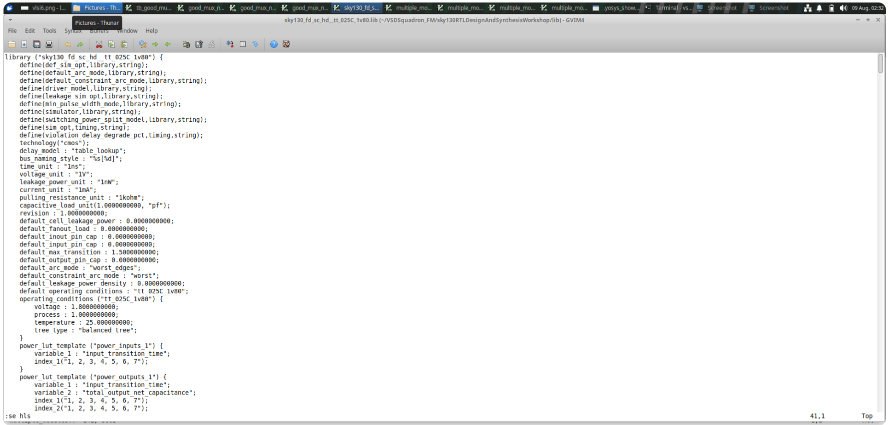
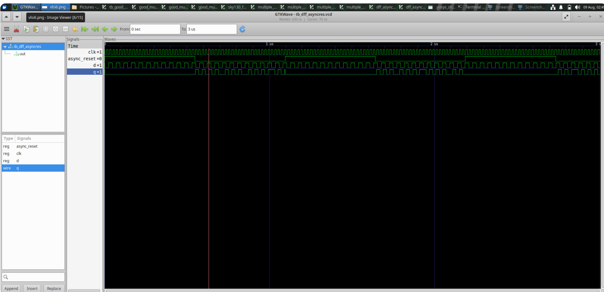
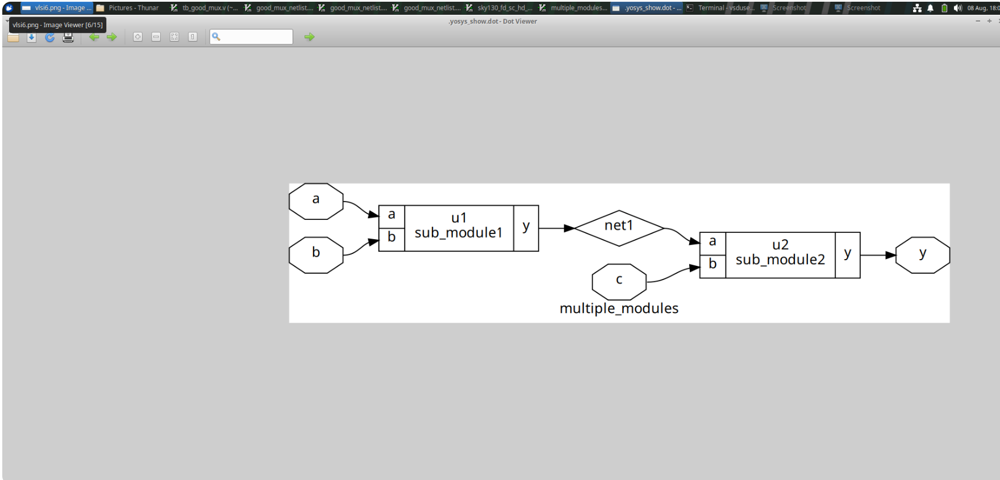
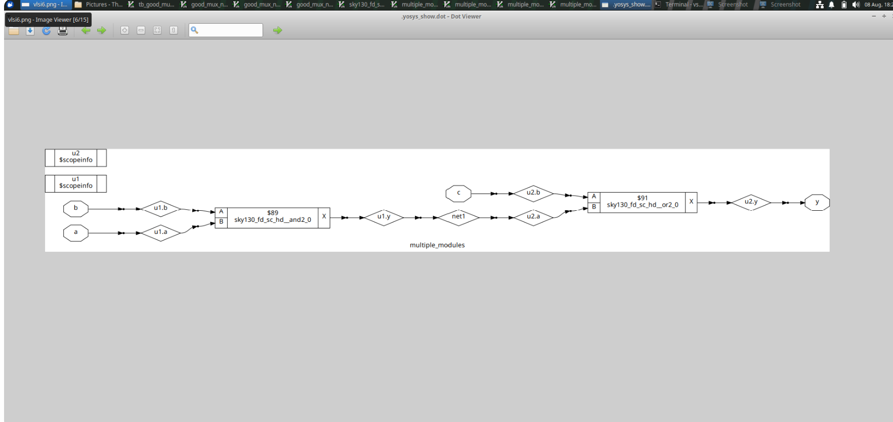
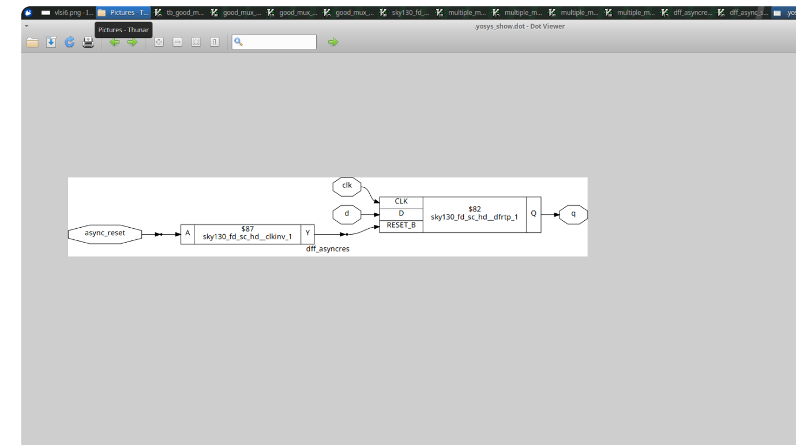

# Module 02 — Timing Libraries, Hierarchy and Sequential Circuits

## 1. Introduction

RTL describes the behavior that a digital circuit is expected to perform. However, a synthesis tool also needs information about the hardware resources available in the target technology.

This module connects RTL design with technology libraries and then studies sequential hardware. The main experiments involve hierarchical organization, D flip-flops, asynchronous reset, asynchronous set, waveform verification and multiplier synthesis.

## 2. Module Objectives

After completing this module, the reader should understand:

- the purpose of a technology library
- the role of a `.lib` file
- the stages involved in RTL-to-netlist conversion
- why hierarchy is useful in large designs
- how a positive-edge-triggered D flip-flop stores data
- how asynchronous reset changes stored state
- how asynchronous set changes stored state
- how sequential behavior is verified in a waveform
- how sequential RTL is connected to standard-cell implementations
- how arithmetic RTL such as multiplication is synthesized

## 3. RTL and the Technology Library

A useful way to visualize the relationship is:

```text
                 RTL Design
                     |
                     v
               Synthesis Tool
                 /                         /                          v             v
        Design behavior   Library cells
                \           /
                 \         /
                  v       v
                Technology
                  Mapping
                     |
                     v
                   Netlist
```

The RTL tells the tool what function is required. The library tells the tool what cells are available for implementation.

## 4. RTL-to-Netlist Conversion

The synthesis process can be divided into several conceptual stages.

### Stage 1 — Read the RTL

The tool parses the Verilog source and identifies modules, signals, operators, procedural blocks and connections.

### Stage 2 — Build an internal representation

The RTL is converted into a form that can be analyzed by the synthesis engine.

### Stage 3 — Optimize logic

Constant values, redundant expressions and other simplification opportunities can be identified.

### Stage 4 — Consider the target technology

The available library cells are examined.

### Stage 5 — Map the design

The logic is represented using cells compatible with the target technology.

### Stage 6 — Produce the netlist

The result is a structural description containing interconnected implementation elements.

## 5. Liberty File Basics

Liberty files provide technology characterization data.

A standard-cell entry may contain information about:

```text
Cell identity
Pin definitions
Logical function
Timing arcs
Input timing
Output timing
Area
Power-related properties
Drive capability
Operating conditions
```

The library may include combinational and sequential cells.

Typical cell categories include:

```text
INV
BUF
AND
OR
NAND
NOR
MUX
DFF
```

Different cells may perform related functions with different input counts or strengths.

## 6. Why Timing Information Matters

Digital signals are not instantaneous in physical hardware.

A transition travels through logic with a delay:

```text
input change
     |
     v
cell response
     |
     v
output change
```

For sequential elements, timing relationships between data and the clock are also important.

Common concepts include:

- propagation delay
- setup time
- hold time
- clock-to-Q delay
- input transition
- output load

The purpose of the library is to provide characterized information that can be used during technology-aware implementation.

## 7. Hierarchical RTL Design

Large designs are easier to understand when divided into smaller modules.

```text
                    TOP
                     |
          +----------+----------+
          |                     |
          v                     v
       CONTROL               DATAPATH
          |                     |
          +----------+----------+
                     |
                     v
                   OUTPUT
```

Each block can be developed and verified separately before being integrated at the top level.

Benefits include:

- improved readability
- reuse of modules
- easier debugging
- clearer ownership of functionality
- simpler verification of individual blocks


## 8. Example of Small Modules

A simple hierarchy may contain:

```verilog
module logic_a (
    input a,
    input b,
    output y
);
assign y = a & b;
endmodule
```

and:

```verilog
module logic_b (
    input x,
    input c,
    output y
);
assign y = x | c;
endmodule
```

A higher-level module can instantiate these blocks and connect their outputs.

## 9. D Flip-Flop Operation

A D flip-flop stores one bit of information.

For a positive-edge-triggered device:

```text
             rising clock edge
                    |
                    v
               Q(next) = D
```

The conceptual structure is:

```text
          D
          |
          v
      +---------+
CLK -->|   DFF   |----> Q
      +---------+
```

During normal operation, the stored output is updated according to the data input at the active clock edge.

## 10. Asynchronous Reset

An asynchronous reset can force the output into a known reset state without waiting for the clock.

For an active-high reset example:

```text
RESET = 1
    |
    v
Q is forced to 0
```

A conceptual view is:

```text
          D
          |
          v
      +---------+
CLK -->|         |----> Q
RST -->|   DFF   |
      +---------+
```

Reset is useful when the circuit must begin from a known state.

Typical situations include:

- initialization
- processor reset
- state-machine startup
- recovery after an abnormal event
- power-up control

## 11. Asynchronous Set

Asynchronous set performs the complementary action.

For an active-high set:

```text
SET = 1
   |
   v
Q is forced to 1
```

The operation occurs independently of normal clocked data capture.

## 12. Reset and Set Comparison

| Feature | Asynchronous Reset | Asynchronous Set |
|---|---|---|
| Forced output | `0` | `1` |
| Requires clock edge | No | No |
| Normal operation | Clocked | Clocked |
| Typical use | Initialize low | Force high state |

The exact behavior and priority depend on the RTL description and the available target cell.

## 13. Waveform Verification

A sequential testbench should observe at least:

```text
CLK
D
RESET
SET
Q
```

The waveform should be checked for:

1. correct clock transitions
2. data capture at the intended clock edge
3. reset response
4. set response
5. stable stored values between relevant events

A conceptual timing relationship is:

```text
D changes ------+
                |
CLK ---- rising edge ----+
                          |
                          v
                        Q updates
```

Asynchronous control signals should be tested separately from normal clocked operation.

## 14. From RTL Flip-Flop to Standard Cell

The RTL representation of a flip-flop is behavioral.

After synthesis:

```text
RTL sequential block
        |
        v
Synthesis
        |
        v
Technology mapping
        |
        v
Suitable library cell
```

If reset or set functionality is required, the implementation must support the intended behavior.

## 15. Multiplier Synthesis

RTL can describe arithmetic at a high level:

```verilog
assign product = a * b;
```

The synthesis tool then determines a hardware implementation.

A conceptual transformation is:

```text
Multiplication operator
        |
        v
Arithmetic interpretation
        |
        v
Logic generation
        |
        v
Optimization
        |
        v
Mapped arithmetic network
```

The resulting structure can depend on operand width, optimization settings and the selected technology library.

## 16. Recommended Experiment Procedure

### Step 1

Write and simulate the RTL.

### Step 2

Inspect the waveform for DFF behavior, reset and set operation.

### Step 3

Create or identify the hierarchy used by the design.

### Step 4

Run synthesis using the selected technology library.

### Step 5

Inspect the generated netlist.

### Step 6

Repeat the process for the arithmetic example.

## 17. Module Conclusion

This module demonstrates that digital implementation depends on both the RTL description and the target technology.

```text
RTL describes the required function
                +
Library describes available implementation resources
                |
                v
Technology-aware synthesis
                |
                v
Gate-level representation
```

The same principle applies to combinational logic, sequential circuits and arithmetic hardware.

## 17. Clocked Versus Asynchronous Behavior

A useful distinction is the event that causes the output state to change.

For ordinary clocked data capture:

```text
D changes
   |
   | wait
   v
active clock edge
   |
   v
Q captures D
```

For asynchronous reset:

```text
reset changes
   |
   v
Q responds without waiting
for the next clock edge
```

This distinction should be visible in simulation.

## 18. Reset Verification Cases

A DFF with asynchronous reset should be tested in at least these situations:

| Case | Clock | Reset | Expected behavior |
|---|---|---|---|
| 1 | running | inactive | normal data capture |
| 2 | running | active | reset state |
| 3 | stopped | active | reset still effective |
| 4 | stopped | inactive | stored value retained |

The third case is particularly useful because it demonstrates why the reset is called asynchronous.

## 19. Set Verification Cases

For an asynchronous set, perform the complementary tests:

| Case | Clock | Set | Expected behavior |
|---|---|---|---|
| 1 | running | inactive | normal operation |
| 2 | running | active | output forced high |
| 3 | stopped | active | output still responds |
| 4 | stopped | inactive | stored value remains |

The exact priority when set and reset are both active depends on the design specification and the selected implementation.

## 20. Clock Edge Identification

For a positive-edge-triggered DFF, the important transition is:

```text
0 -> 1
```

on the clock.

A waveform should therefore be inspected around each rising edge.

For example:

```text
CLK: ___/‾‾\___/‾‾\___
          ^       ^
          |       |
        sample  sample
```

The value of `D` at the relevant edge determines the next stored value during normal operation.

## 21. Why Sequential Logic Needs Special Attention

Combinational logic responds to current inputs.

Sequential logic depends on:

```text
current inputs
+
previous state
+
clock/control events
```

This additional state makes verification more involved.

A sequential waveform should therefore show both the control events and the stored output.

## 22. Hierarchy and Debugging

Hierarchy can make debugging easier because the designer can isolate a block.

For example:

```text
top
 |
 +-- register_bank
 |
 +-- arithmetic_unit
 |
 +-- control_unit
```

If an output is incorrect, the designer can first determine which submodule produces the unexpected signal.

This is easier than debugging one very large monolithic module.

## 23. Hierarchy and Reuse

A module can be instantiated multiple times.

For example:

```verilog
logic_a u0 (...);
logic_a u1 (...);
logic_a u2 (...);
```

The same design definition is reused while each instance receives different connections.

This helps maintain consistency across repeated structures.

## 24. Standard-Cell Selection

Technology mapping may have multiple candidate cells.

For a simple Boolean operation, the library could contain cells with different drive strengths or characteristics.

The synthesis process can therefore consider implementation requirements rather than simply choosing one arbitrary gate.

The library is an implementation vocabulary:

```text
RTL behavior
    |
    v
Candidate cells
    |
    v
Selected implementation
```

## 25. Timing-Aware Thinking

A sequential path can be represented conceptually as:

```text
launch register
      |
      v
combinational logic
      |
      v
capture register
```

The time available for the combinational path is related to the clock period and sequential timing requirements.

Even when a detailed timing analysis is outside this module, the designer should understand why library timing information matters.

## 26. Multiplier Width

If:

```text
a = N bits
b = M bits
```

the mathematical product may require up to approximately:

```text
N + M bits
```

depending on the representation and intended range.

Therefore, arithmetic RTL should define signal widths carefully.

## 27. Signed and Unsigned Arithmetic

Arithmetic interpretation can depend on whether operands are signed or unsigned.

A designer should therefore avoid assuming that:

```verilog
a * b
```

always means the same hardware behavior regardless of declarations.

For reusable arithmetic modules, widths and signedness should be explicit.

## 28. Multiplier Verification

A useful testbench should include:

- zero values
- small non-zero values
- maximum values
- asymmetric operands
- values that produce carries into higher bits

For example:

```text
0 * X
1 * X
2 * X
maximum * 1
maximum * small value
```

These cases reveal width and arithmetic mistakes.

## 29. Netlist Inspection

After synthesis, examine:

```text
number of cells
cell types
number of registers
combinational structures
connections
```

For a sequential design, check whether the expected storage elements are present.

For a multiplier, identify whether the arithmetic operator has become a network of logic or another supported implementation structure.

## 30. Extended Summary

This module connects three viewpoints:

```text
Behavioral viewpoint
        |
        v
What should the circuit do?

Structural viewpoint
        |
        v
Which hardware elements implement it?

Technology viewpoint
        |
        v
Which characterized cells can realize it?
```

Understanding all three viewpoints is important when moving from classroom RTL to practical implementation.
