# Module 03 — Combinational and Sequential Optimization

## 1. Introduction

Synthesis tools do more than translate RTL syntax into gates. They analyze the behavior of the design and search for a simpler implementation that preserves the required observable functionality.

This module studies optimization using both combinational and sequential examples. The experiments demonstrate Boolean simplification, constant propagation, elimination of unnecessary logic and analysis of counters whose complete internal state may not be required by the output.

## 2. Objectives

The objectives are:

- understand the idea of logic optimization
- observe simplification of combinational expressions
- study conditional logic that can become basic Boolean gates
- understand constant propagation
- examine unnecessary sequential storage
- study counter optimization
- compare RTL behavior with the optimized result
- understand why the synthesized structure may differ from the source

## 3. What Does Optimization Preserve?

The target is not to preserve the exact source-code structure.

The important requirement is:

```text
Required RTL behavior
         =
Required optimized behavior
```

The implementation may change substantially.

For example:

```text
complex expression
      |
      v
Boolean analysis
      |
      v
simpler expression
      |
      v
smaller hardware structure
```
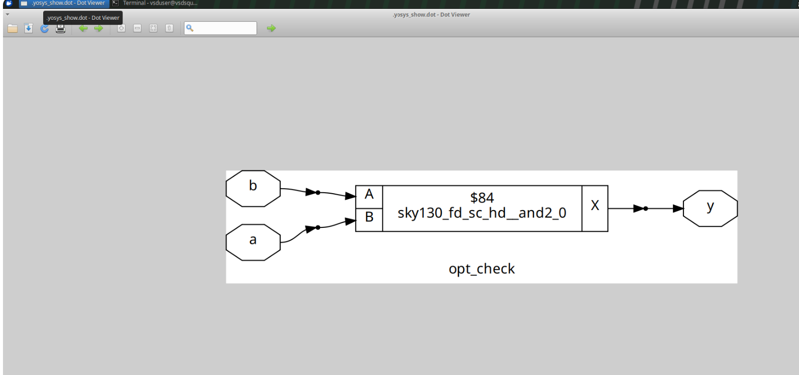
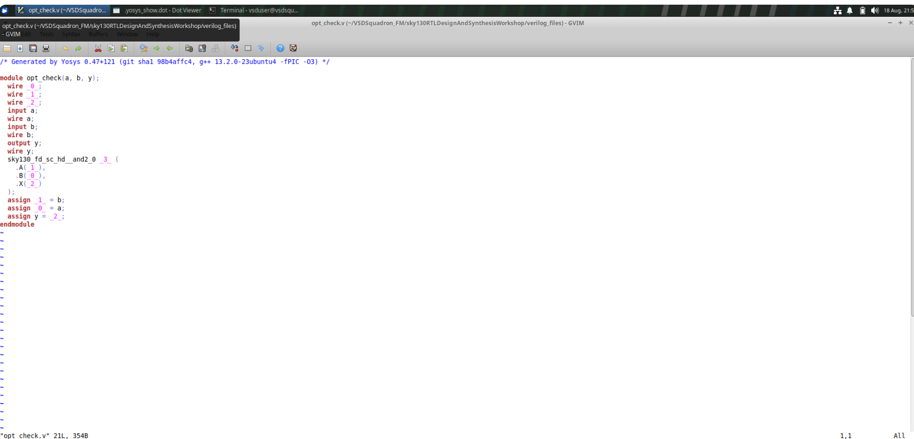
## 4. Basic Boolean Simplification

Consider:

```text
y = a & 1
```

Because AND with logic 1 does not change the value:

```text
y = a
```

Similarly:

```text
y = a | 0
```

can reduce to:

```text
y = a
```

These examples show that an RTL expression can contain operations that are unnecessary after logical analysis.

## 5. Conditional Logic Experiment

Consider:

```verilog
module opt_check (
    input a,
    input b,
    output y
);

assign y = a ? b : 0;

endmodule
```

The behavior can be written as:

| `a` | `b` | `y` |
|---|---|---|
| 0 | 0 | 0 |
| 0 | 1 | 0 |
| 1 | 0 | 0 |
| 1 | 1 | 1 |

This is equivalent to:

```text
y = a & b
```

The conditional source structure can therefore be represented by a simple AND relationship.
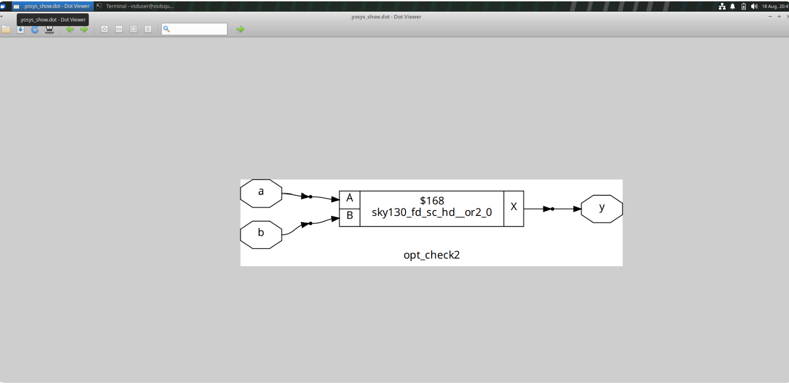
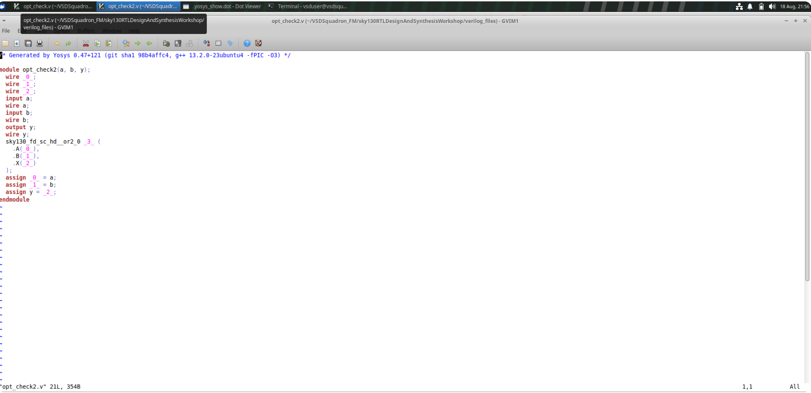
## 6. Constant-True Branch

Another experiment is:

```verilog
assign y = a ? 1 : b;
```

The behavior is:

```text
a = 1 -> y = 1
a = 0 -> y = b
```

This can be expressed as:

```text
y = a | b
```

Again, synthesis is free to use the simpler equivalent logic.

## 7. Nested Conditional Logic

Consider:

```verilog
assign y = a ? (c ? b : 0) : 0;
```

For the output to become high, all required conditions must be satisfied.

The expression can be viewed as:

```text
y = a & c & b
```

The nested conditional structure is therefore not necessarily retained as a chain of multiplexers in the final implementation.

## 8. Complex Optimization Cases

A more complicated expression may contain repeated signals and nested branches:

```verilog
assign y = a ? (b ? (a & c) : c) : (!c);
```

Such an expression is useful for observing how the optimizer analyzes relationships across multiple branches.

The important lesson is that synthesis does not need to preserve the original formatting or apparent nesting of the RTL.
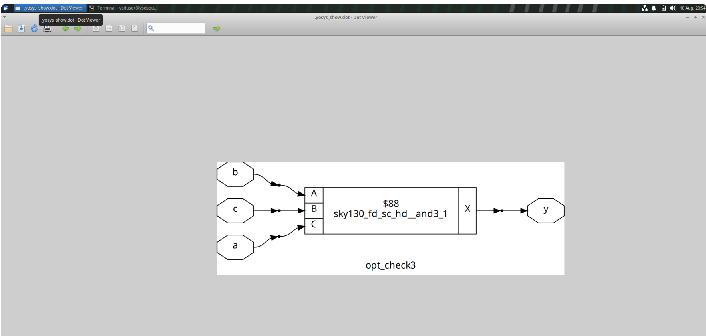
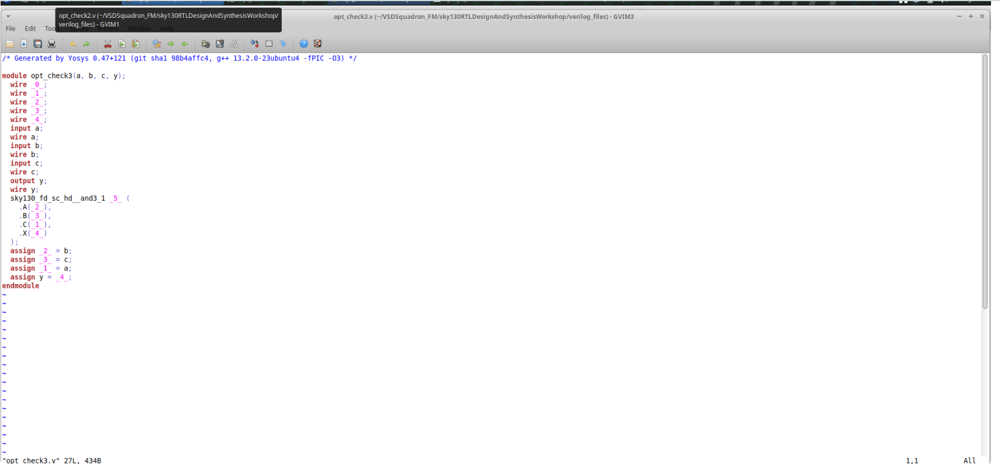
## 9. Sequential Optimization

Optimization can also remove or simplify state elements.

Consider:

```verilog
always @(posedge clk or posedge reset)
begin
    if (reset)
        q <= 1'b0;
    else
        q <= 1'b0;
end
```

The value of `q` is always zero.

Therefore the conceptual analysis becomes:

```text
Sequential block
      |
      v
State never changes
      |
      v
Output is constant
      |
      v
Storage may be unnecessary
```

The synthesized implementation can replace unnecessary sequential hardware with simpler logic.
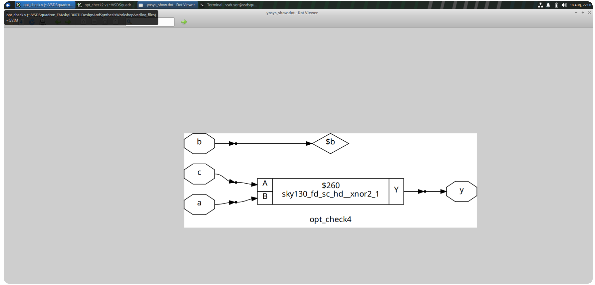
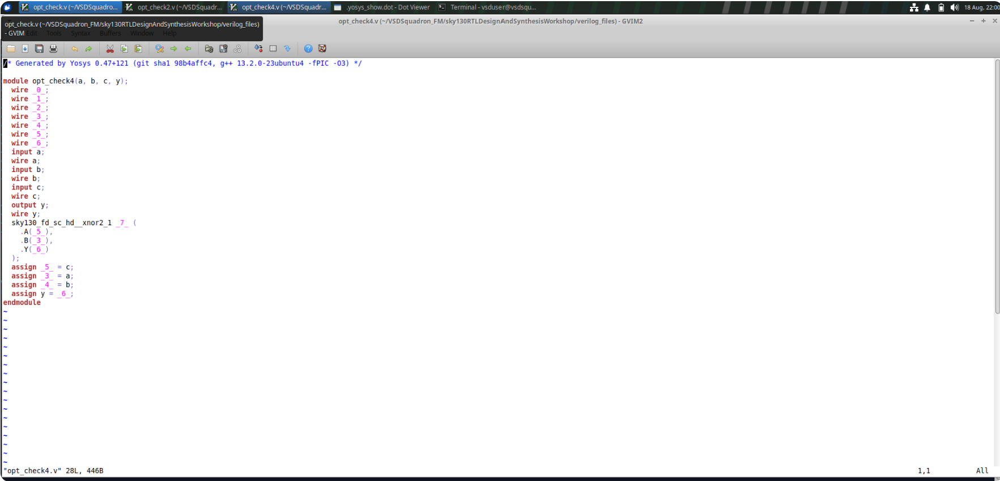
## 10. Constant Propagation

Suppose an internal register is always assigned a constant.

That constant can affect downstream logic:

```text
constant register value
         |
         v
dependent expression
         |
         v
expression simplifies
         |
         v
more logic may become removable
```

This is one reason optimization should be viewed across connected logic rather than as isolated line-by-line transformations.

## 11. Register Declaration Does Not Guarantee a Physical Flip-Flop

A common mistake is to assume:

```text
reg in RTL
    =
physical flip-flop
```

This is not always true after synthesis.

The synthesis engine considers whether meaningful state is actually required to implement the observable behavior.

If a register is proven unnecessary, it may disappear from the optimized netlist.
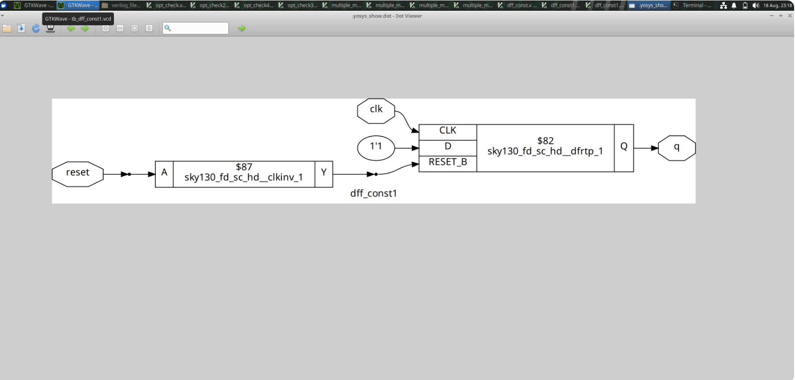
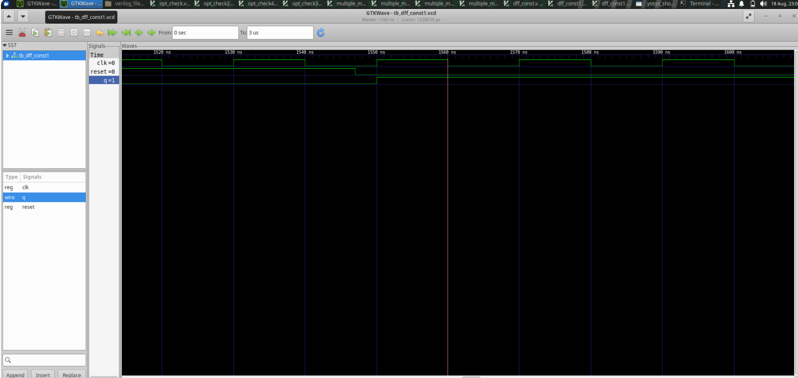
## 12. Counter Experiment

A three-bit counter can be described as:

```verilog
reg [2:0] count;

always @(posedge clk or posedge reset)
begin
    if (reset)
        count <= 3'b000;
    else
        count <= count + 1;
end
```

The state sequence is:

```text
000
001
010
011
100
101
110
111
```

The interesting question is whether every state bit is needed by the final output.
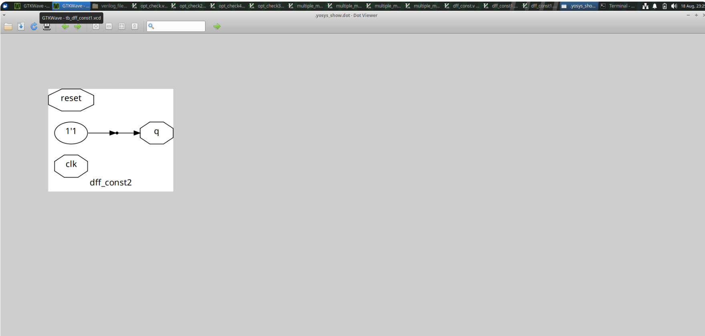
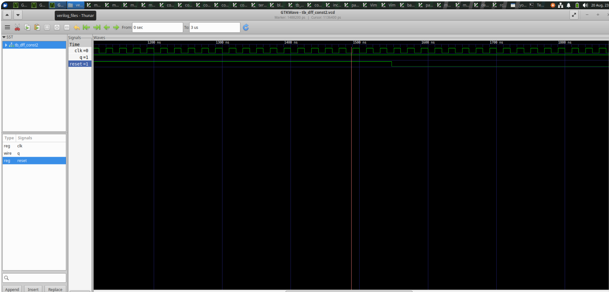
## 13. Counter Optimization — Single Observable Bit

Consider:

```verilog
assign q = count[0];
```

Only the least significant bit is directly used.

The synthesis engine can analyze whether the remaining state bits are necessary for producing the required output.

Conceptually:

```text
3-bit counter
      |
      v
only count[0] observed
      |
      v
analyze required state
      |
      v
optimized implementation
```

## 14. Counter Optimization — Equality Detection

Another experiment is:

```verilog
assign q = (count[2:0] == 3'b100);
```

The output is asserted when the counter reaches a particular value.

The implementation includes both state progression and comparison logic, allowing the optimizer to examine the combined behavior.

## 15. Simulation and Verification

Optimization should not be accepted without checking behavior.

The recommended flow is:

```text
RTL
 |
 v
Simulation
 |
 v
Waveform
 |
 v
Synthesis
 |
 v
Optimization
 |
 v
Optimized Netlist
```

For sequential circuits, inspect:

- clock
- reset
- register values
- counter transitions
- output response
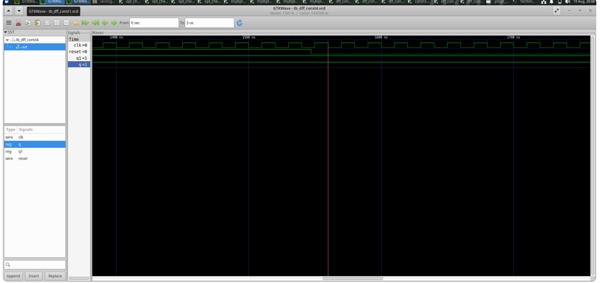
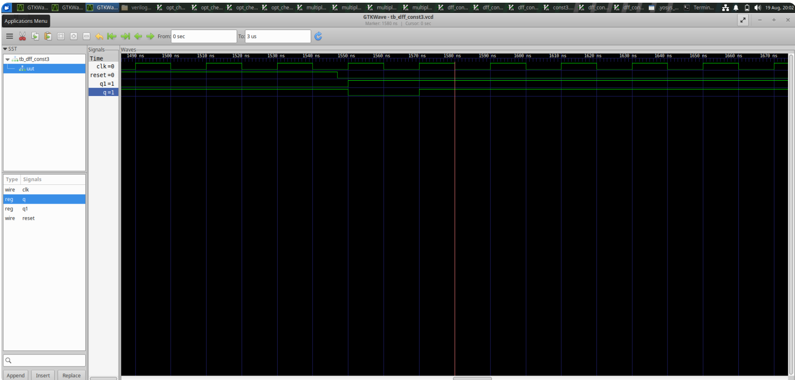
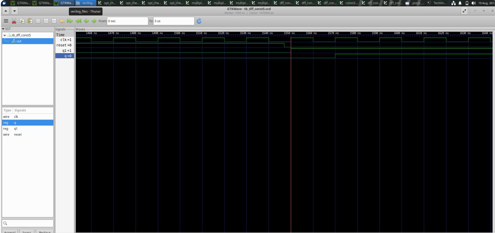
## 16. RTL Versus Optimized Hardware

A useful comparison is:

| RTL View | Optimized View |
|---|---|
| source expressions | simplified logic |
| explicit conditional statements | equivalent Boolean network |
| declared registers | required storage only |
| full counter description | logic needed for observable behavior |
| source complexity | implementation complexity |

The structures can be different while the intended output behavior remains the same.
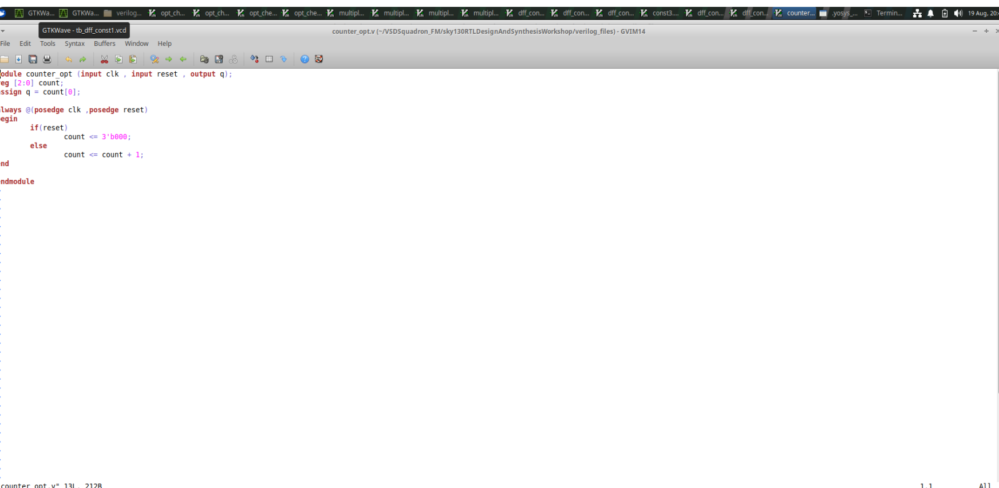
## 17. Practical Verification Questions

After synthesis, ask:

1. Which expressions disappeared?
2. Which gates were simplified?
3. Were any registers removed?
4. Did the counter structure change?
5. Does the simulation still show the expected behavior?

## 18. Module Conclusion

The central idea is:

```text
Same function
does not require
same implementation structure
```

Optimization changes the hardware representation when it can do so without changing the required behavior. This principle applies to simple Boolean logic, nested conditions, constant values and sequential state.

## 19. Optimization as a Global Process

A synthesis optimizer can analyze connected logic rather than treating each line independently.

For example:

```text
logic A
  |
  v
logic B
  |
  v
constant
  |
  v
logic C
```

If the value entering logic C is known, the optimizer may simplify C. That simplification can then expose another optimization opportunity in logic B.

This creates a chain reaction:

```text
one simplification
      |
      v
new known value
      |
      v
second simplification
      |
      v
third simplification
```

## 20. Redundant Logic

Redundant logic is logic whose removal does not alter required outputs.

Examples include:

- unused internal signals
- repeated expressions
- unreachable branches
- operations with constants
- registers whose values are never observed meaningfully

Removing redundancy can reduce implementation complexity.

## 21. Unused Outputs and Logic Cones

An output depends on a set of upstream signals.

This connected region can be considered a logic cone:

```text
inputs
  \ | /
   \|/
 logic
   |
   v
 output
```

If a signal is not part of any required output cone, the associated hardware may be unnecessary.

This is one reason output usage matters during synthesis.

## 22. Constant Inputs

Consider:

```verilog
assign y = a & 1'b0;
```

The result is always zero.

Similarly:

```verilog
assign y = a | 1'b1;
```

The result is always one.

These are simple examples of constant propagation and Boolean reduction.

## 23. Propagation Through Multiple Levels

Suppose:

```text
x = 0
y = x & a
z = y | b
```

Then:

```text
x = 0
   |
   v
y = 0
   |
   v
z = b
```

The optimizer can propagate the known value through the logic.

## 24. Optimization Does Not Mean Arbitrary Change

An optimization is valid only when the required behavior remains equivalent.

Conceptually:

```text
Before:
input set -> output behavior

After:
input set -> same required output behavior
```

The internal implementation is allowed to change, but the specified behavior must remain consistent.

## 25. Counter State Analysis

A counter is a useful sequential optimization example because it contains multiple state bits.

For a 3-bit counter:

```text
count[2:0]
```

there are eight possible states.

If the design only observes one property of the counter, not all internal information may be necessary.

For example:

```verilog
assign even = ~count[0];
```

Only the least significant bit determines whether the count is even or odd.

## 26. Counter Output Dependencies

Consider three possible outputs:

```text
q0 = count[0]
q1 = count[2:1]
q2 = count == 3'b101
```

The hardware required for each output can be different because each output observes different information.

This demonstrates a general principle:

```text
Required outputs
      |
      v
Required information
      |
      v
Required state/logic
```

## 27. Register Removal

A register can potentially be removed when the synthesis tool proves that its stored value does not contribute meaningful observable behavior.

The reasoning may be:

```text
register output
     |
     v
constant or unused
     |
     v
storage provides no required function
     |
     v
remove storage
```

The actual result depends on the complete design context.

## 28. Common Subexpression Reasoning

If the same logical expression appears multiple times, synthesis can potentially recognize common structure.

For example:

```text
x1 = a & b
x2 = a & b
```

Both expressions have the same value.

A shared implementation can avoid unnecessary duplication when appropriate.

## 29. Optimization and Area

Removing logic can reduce the number of implementation cells.

A conceptual area relationship is:

```text
fewer gates
    |
    v
less occupied cell area
```

However, optimization objectives can involve trade-offs. A structure that saves area may not always be the best structure for timing.

## 30. Optimization and Timing

Logic depth matters.

For example:

```text
A -> gate -> gate -> gate -> Y
```

contains more logic levels than:

```text
A -> gate -> Y
```

A synthesis flow may attempt to simplify or restructure logic to meet timing goals while preserving function.

## 31. Optimization and Power

Switching activity also matters.

Reducing unnecessary transitions can potentially reduce dynamic power.

Conceptually:

```text
unnecessary switching
        |
        v
reduced activity
        |
        v
potential power benefit
```

A complete power analysis requires technology-specific information and activity assumptions.
