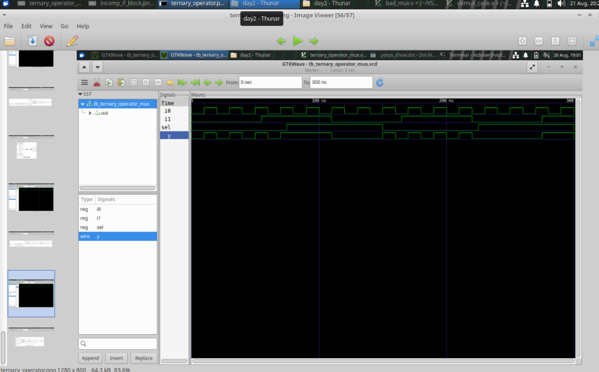
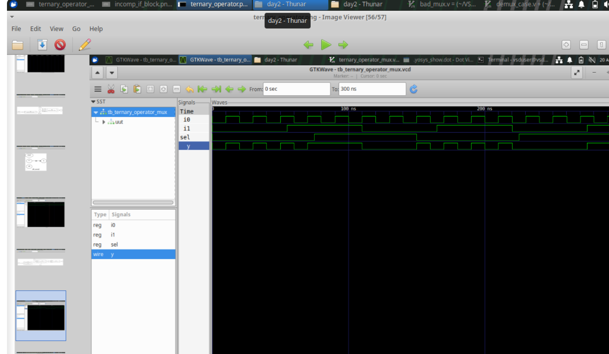
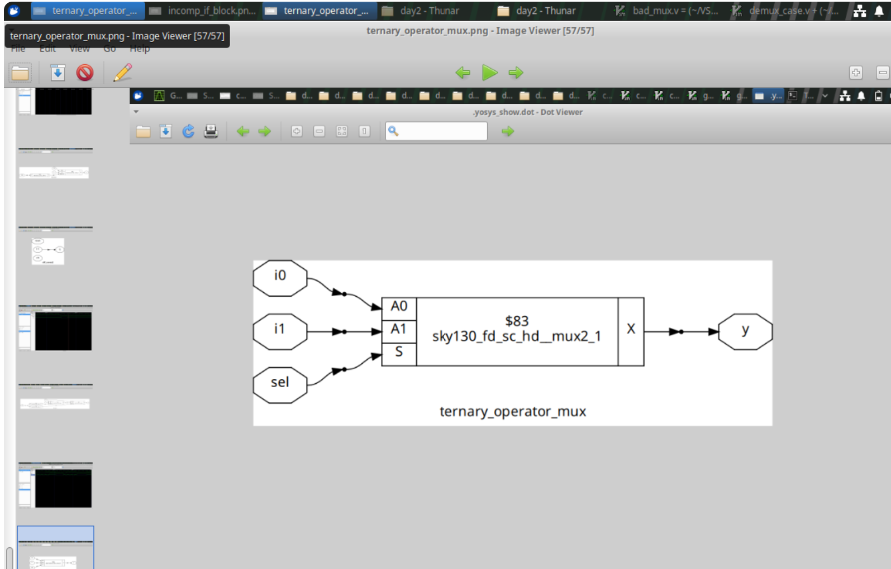
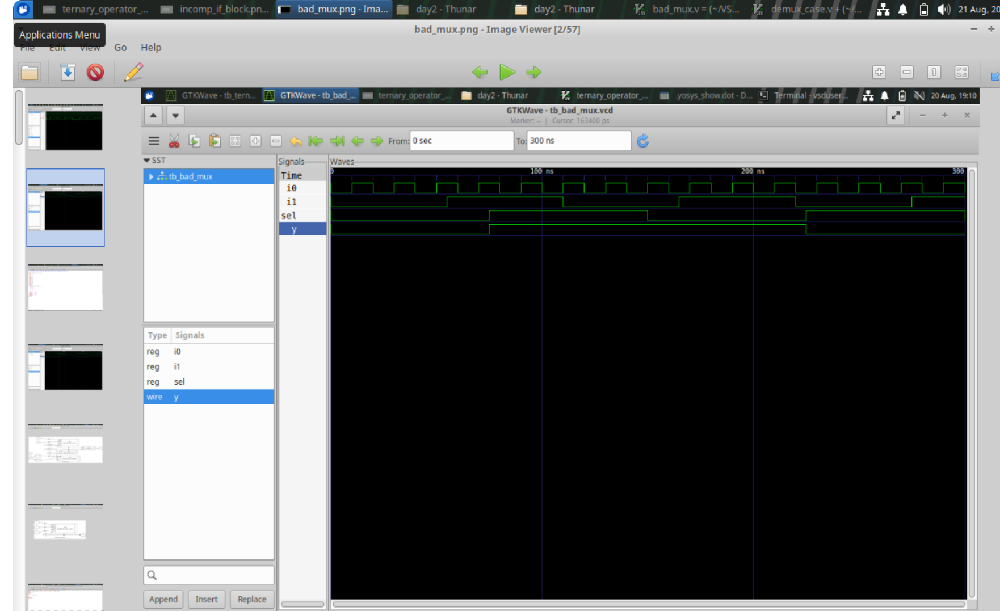
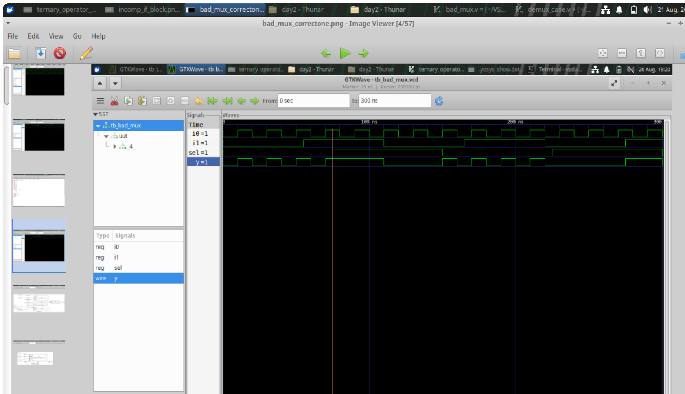
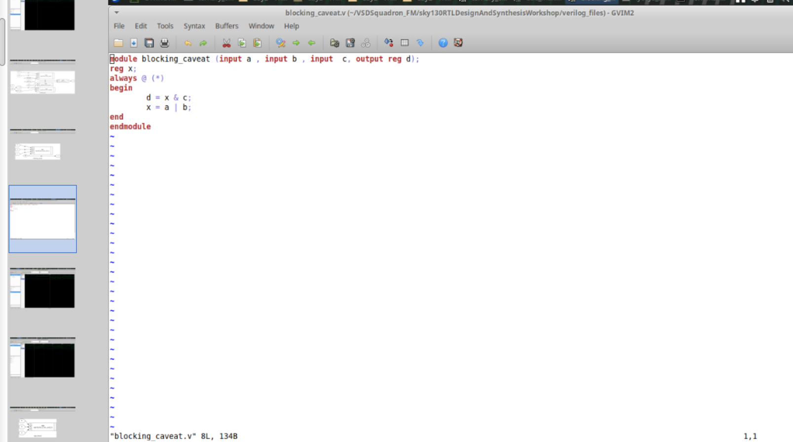
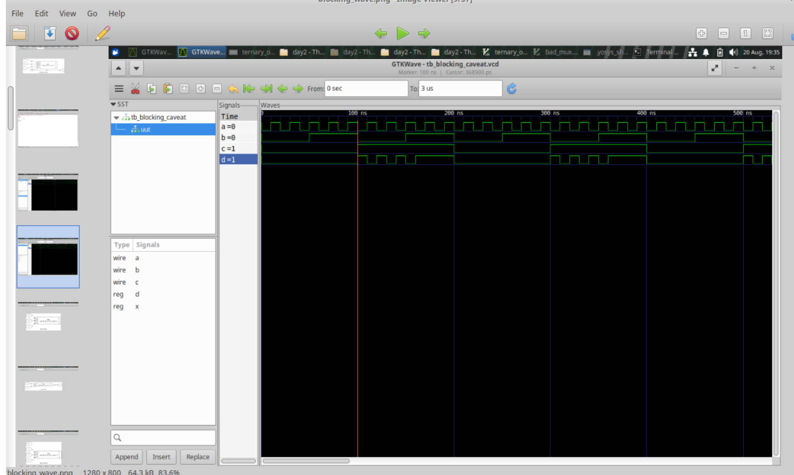
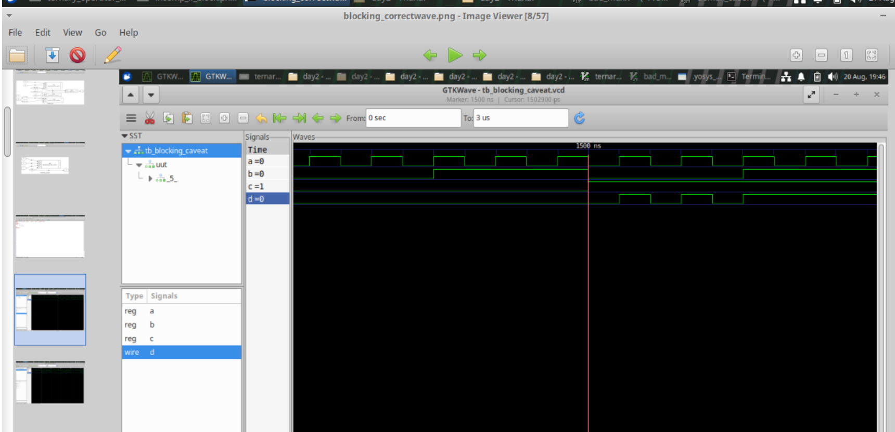
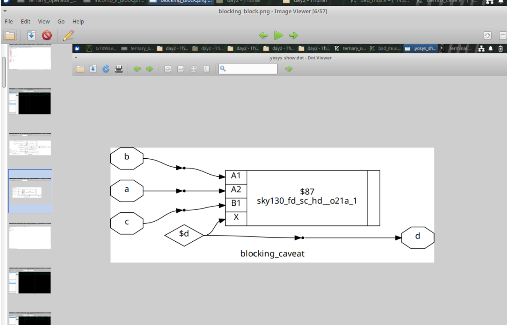

# Module 04 — RTL Coding Semantics and Gate-Level Verification

## 1. Introduction

Verilog is used both to describe hardware and to simulate the behavior of that description. Because simulation follows language semantics, small coding choices can produce different observed results.

This module studies:

- combinational MUX coding styles
- sensitivity-list problems
- blocking assignments
- non-blocking assignments
- procedural statement ordering
- RTL simulation
- synthesis
- gate-level simulation

The goal is to connect the source code, simulator behavior and synthesized hardware.

## 2. Module Objectives

After completing this module, you should be able to:

- describe a MUX using different Verilog styles
- explain why an incomplete sensitivity list can cause a simulation problem
- distinguish blocking and non-blocking assignments
- understand why procedural ordering matters
- explain the difference between RTL simulation and GLS
- follow a complete flow from RTL to a synthesized netlist and back into simulation

## 3. 2:1 Multiplexer Behavior

The basic selection rule is:

```text
sel = 0 -> output = i0
sel = 1 -> output = i1
```

A concise implementation is:

```verilog
module ternary_operator_mux (
    input i0,
    input i1,
    input sel,
    output y
);

assign y = sel ? i1 : i0;

endmodule
```

The ternary operator expresses a conditional selection directly.


## 4. Procedural MUX Coding

The same behavior can be described using an `always` block:

```verilog
always @(*)
begin
    if (sel)
        y = i1;
    else
        y = i0;
end
```

Both styles describe the same intended combinational function when written correctly.

## 5. The Sensitivity List Problem

Consider:

```verilog
always @(sel)
begin
    if (sel)
        y = i1;
    else
        y = i0;
end
```

The block reads `i0` and `i1`, but only `sel` appears in the sensitivity list.

Suppose the current values are:

```text
sel = 0
i0  = 0
y   = 0
```

If `i0` changes to `1` while `sel` remains `0`, the block may not execute because the simulator is only watching `sel`.

The output can therefore remain stale in simulation.

## 6. Why `always @(*)` Helps

Using:

```verilog
always @(*)
```

allows the simulator to include the signals read by the procedural block.

This is more suitable for combinational descriptions because the output is expected to respond to changes in all relevant inputs.

A conceptual comparison:

```text
Incomplete list:
change in missing signal
        |
        v
block may not run

always @(*):
change in relevant input
        |
        v
block reevaluates
```


## 7. Blocking Assignment

Blocking assignment uses:

```verilog
=
```

Example:

```verilog
always @(*)
begin
    a = b;
    c = a;
end
```

During procedural execution:

```text
b
|
v
a updated immediately
|
v
c uses the updated value of a
```

This makes blocking assignments useful for many combinational procedural descriptions.



## 8. Statement Ordering

Consider:

```verilog
always @(*)
begin
    d = a & b;
    x = d & c;
end
```

The second statement sees the value assigned to `d` by the first statement during the same execution of the block.

This illustrates why the order of blocking statements can affect the simulation model.

## 9. Non-Blocking Assignment

Non-blocking assignment uses:

```verilog
<=
```

A standard sequential example is:

```verilog
always @(posedge clk)
begin
    q <= d;
end
```

The assignment is scheduled according to non-blocking semantics rather than updating immediately in procedural order.

A common coding guideline is:

```text
Combinational procedural logic -> blocking assignment
Clocked sequential logic       -> non-blocking assignment
```

The goal is to reduce simulation-order issues and represent sequential updates clearly.

## 10. RTL Simulation

RTL simulation verifies the behavioral description before synthesis.

The flow is:

```text
RTL
 |
 v
Testbench
 |
 v
Simulator
 |
 v
Waveform
```

Questions answered at this stage include:

- Does the design respond correctly to input changes?
- Are selector values handled correctly?
- Does the clocked logic update at the intended event?
- Do reset conditions behave as expected?

## 11. Synthesis

After RTL verification, the design can be synthesized.

```text
RTL
 |
 v
Logic analysis
 |
 v
Optimization
 |
 v
Technology mapping
 |
 v
Gate-level netlist
```

The generated netlist represents the design using structural elements rather than the original behavioral RTL style.


## 12. Gate-Level Simulation

Gate-Level Simulation uses the synthesized representation.

The conceptual setup is:

```text
Testbench
    |
    v
Synthesized Netlist
    +
Standard-cell models
    |
    v
Simulator
    |
    v
GLS waveform
```

GLS provides another verification point after synthesis.

## 13. RTL Simulation vs GLS

| Feature | RTL Simulation | Gate-Level Simulation |
|---|---|---|
| Uses behavioral RTL | Yes | No |
| Uses synthesized netlist | No | Yes |
| Checks functionality | Yes | Yes |
| Includes implementation structure | Limited | Yes |
| Uses cell-level models | Usually no | Yes |

The expected functional relationship should remain consistent between the two stages.

## 14. Complete Verification Flow

A recommended procedure is:

### Step 1 — Develop RTL

Create the Verilog design.

### Step 2 — Build a testbench

Generate meaningful input combinations.

### Step 3 — Run RTL simulation

Confirm functional behavior.

### Step 4 — Inspect the waveform

Check the relationship between inputs and outputs.

### Step 5 — Run synthesis

Generate an optimized or mapped netlist.

### Step 6 — Prepare GLS

Use the synthesized netlist and required library models.

### Step 7 — Run the same or equivalent testbench

Observe the post-synthesis response.

### Step 8 — Compare results

Verify that the required functionality is preserved.

## 15. Common Issues to Investigate

If RTL and GLS differ, investigate:

- incorrect top-module selection
- missing library models
- incorrect netlist connections
- differences in reset behavior
- simulation setup problems
- unexpected inferred hardware

## 16. Module Conclusion

The important relationship is:

```text
Verilog source
      |
      +--> simulation semantics
      |
      +--> synthesis inference
```

Understanding both paths is necessary for reliable RTL development.

A strong verification flow therefore uses:

```text
Correct coding style
        +
RTL simulation
        +
Synthesis inspection
        +
Gate-level simulation
```

Together, these stages provide more confidence than RTL simulation alone.

## 17. Why Coding Semantics Matter

Verilog statements have simulation semantics.

Two descriptions can appear similar but behave differently in a simulator because of:

- event scheduling
- sensitivity lists
- blocking assignments
- non-blocking assignments
- procedural ordering

The designer must therefore understand not only the intended hardware but also how the simulator interprets the source.

## 18. Combinational Coding Checklist

For a combinational procedural block:

```text
1. Identify every input read.
2. Make the block sensitive to relevant inputs.
3. Assign every output for every required condition.
4. Prefer a clear combinational coding style.
5. Simulate representative cases.
```

This reduces the chance of simulation mismatches and unintended latch inference.

## 19. Example of a Safe Combinational Pattern

A useful pattern is:

```verilog
always @(*)
begin
    y = 1'b0;

    if (sel)
        y = i1;
    else
        y = i0;
end
```

The default assignment ensures that `y` receives a value before conditional refinement.

The exact coding style can vary, but the underlying requirement is completeness.

## 20. Blocking Assignment Timeline

For:

```verilog
always @(*)
begin
    x = a;
    y = x;
end
```

the procedural flow is:

```text
block starts
   |
   v
x receives a
   |
   v
y reads x
   |
   v
block completes
```

This is why blocking assignment is commonly used for combinational procedural logic.

## 21. Non-Blocking Assignment Timeline

For:

```verilog
always @(posedge clk)
begin
    q <= d;
end
```

the update follows non-blocking scheduling semantics.

This is useful for representing clocked storage because multiple registers can conceptually sample their inputs at the same clock event.

## 22. Multiple Sequential Assignments

Consider:

```verilog
always @(posedge clk)
begin
    q1 <= d;
    q2 <= q1;
end
```

The intent is that `q2` receives the previous value of `q1`, not the newly scheduled value from the same clock event.

This is one reason non-blocking assignment is appropriate for sequential logic.

## 23. Why Testbenches Matter

A testbench should not only create random activity. It should deliberately exercise important functional conditions.

For a MUX:

```text
sel = 0
sel = 1
i0 changes while selected
i1 changes while selected
i0 changes while unselected
i1 changes while unselected
```

This helps reveal sensitivity-list and selection errors.

## 24. Sensitivity-List Demonstration

An incomplete sensitivity list can be exposed by holding `sel` constant while changing an input.

Example:

```text
sel = 0
i0: 0 -> 1
```

A correct combinational model should update `y`.

If the block is sensitive only to `sel`, the simulator may not reevaluate the block.

This makes the test specifically useful for demonstrating the problem.

## 25. RTL Simulation Is Not the Final Step

RTL simulation checks the source-level behavioral model.

But synthesis can introduce:

- optimized logic
- technology cells
- different structural organization
- timing models
- implementation-specific details

Therefore, post-synthesis verification can provide additional confidence.

## 26. Gate-Level Netlist Structure

A gate-level netlist may contain instances such as:

```text
standard cell instance
      |
      +-- input connections
      |
      +-- output connection
```

The original `if` statement may no longer exist.

Instead, the behavior is represented through connected cells.

## 27. Library Models in GLS

Gate-level simulation needs models for the cells instantiated in the netlist.

Conceptually:

```text
netlist cell instance
       +
cell model
       |
       v
simulator understands cell behavior
```

Without appropriate models, the simulator cannot correctly evaluate the mapped cells.

## 28. Functional GLS

A functional gate-level simulation can be used to confirm that the synthesized structure still produces expected values.

The testbench can remain similar to the RTL testbench if the ports are unchanged.

The main difference is the design being instantiated.

## 29. Timing-Aware GLS

A timing-oriented gate-level simulation can additionally involve delay information.

The conceptual model becomes:

```text
input transition
      |
      v
cell delay
      |
      v
output transition
```

This provides a view closer to implemented hardware behavior.

## 30. Debugging RTL/GLS Differences

If the outputs disagree, use a structured process:

```text
Check testbench
       |
       v
Check top module
       |
       v
Check netlist
       |
       v
Check cell models
       |
       v
Check reset/control behavior
       |
       v
Check waveform timing
```

Do not immediately assume that synthesis changed the functional intent.

## 31. Verification Evidence

A good repository can include screenshots or notes showing:

- successful RTL compilation
- waveform output
- synthesis statistics
- generated netlist
- GLS result

These artifacts make the project easier to review.

## 32. Reusable Verification Method

For future designs, use the same basic process:

```text
Write RTL
   |
   v
Write testbench
   |
   v
Run RTL simulation
   |
   v
Review waveform
   |
   v
Synthesize
   |
   v
Run GLS
   |
   v
Compare behavior
```

The exact tools can change, but the reasoning remains useful.

## 33. Extended Summary

The key lesson is that RTL coding is both a hardware-description task and a simulation-modeling task.

A strong design process considers:

```text
Hardware intent
      +
Verilog semantics
      +
Simulation behavior
      +
Synthesis inference
      +
Post-synthesis verification
```

Understanding this connection helps prevent subtle errors that may not be obvious from the source code alone.
