# Module 05 — RTL Completeness, Latch Inference and Generated Hardware

## 1. Introduction

RTL coding style directly affects the hardware inferred by synthesis. A description that appears small or harmless can create storage elements when assignments are incomplete. On the other hand, complete combinational logic can synthesize into straightforward selector structures.

This module studies:

- combinational RTL
- incomplete `if` statements
- incomplete `case` statements
- latch inference
- complete conditional descriptions
- MUX implementations
- DEMUX implementations
- `generate` constructs
- ripple-carry adders
- simulation and synthesis inspection

## 2. Module Objectives

The objectives are to understand:

- why every combinational output must have a defined value
- how incomplete assignments can create latches
- how `if-else` structures describe selection
- how `case` statements describe multi-way selection
- how `default` can complete a case structure
- how MUX and DEMUX hardware can be described
- how repeated structures can be created with `generate`
- how a ripple-carry adder is assembled
- how simulation and synthesis should be used together

## 3. Synthesis-Oriented RTL

The synthesis process interprets behavior:

```text
RTL
 |
 v
Analyze behavior
 |
 v
Infer required hardware
 |
 v
Optimize
 |
 v
Map to implementation cells
```

For this reason, the intended hardware should be expressed completely and clearly.

## 4. Combinational Logic Requires Complete Assignment

Consider:

```verilog
always @(*)
begin
    if (i0)
        y = i1;
end
```

When `i0 = 1`, the output receives `i1`.

But when `i0 = 0`, the block gives `y` no new value.

The implied behavior is:

```text
No new assignment
        |
        v
Previous value must be retained
        |
        v
Storage behavior required
        |
        v
Latch may be inferred
```

## 5. Latch Inference

A latch stores a value while its control condition is inactive.

An incomplete combinational description can unintentionally request this behavior.

Conceptually:

```text
input condition true  -> output is updated
input condition false -> output keeps old value
```

The second condition is the key reason a latch may appear.

## 6. Fixing an Incomplete `if`

A complete description can be written as:

```verilog
always @(*)
begin
    if (i0)
        y = i1;
    else
        y = 1'b0;
end
```

Now every branch assigns a value to `y`.

The intended result is purely combinational behavior.

## 7. Multiple Conditions

Consider:

```verilog
always @(*)
begin
    if (i0)
        y = i1;
    else if (i2)
        y = i3;
end
```

The combination:

```text
i0 = 0
i2 = 0
```

still leaves `y` without a new assignment.

A complete form is:

```verilog
always @(*)
begin
    if (i0)
        y = i1;
    else if (i2)
        y = i3;
    else
        y = 1'b0;
end
```

## 8. Incomplete `case` Statement

A two-bit selector has four combinations:

```text
00
01
10
11
```

If only some are handled:

```verilog
always @(*)
begin
    case (sel)
        2'b00: y = i0;
        2'b01: y = i1;
    endcase
end
```

then the remaining selector values can leave the output unchanged.

This can again imply latch behavior.
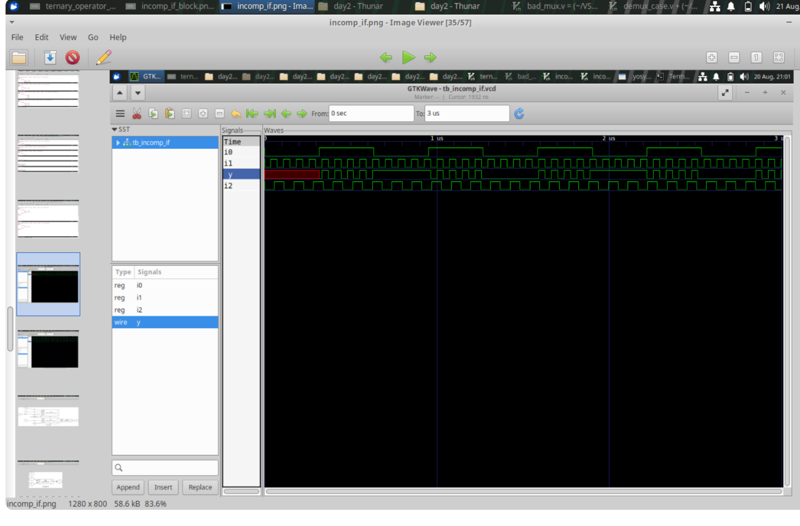
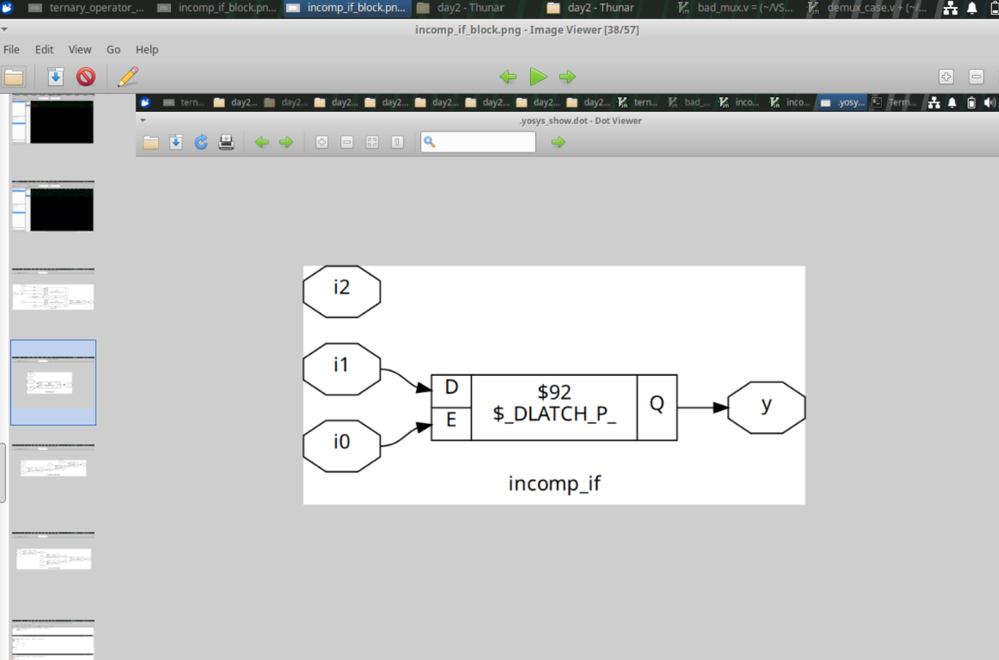
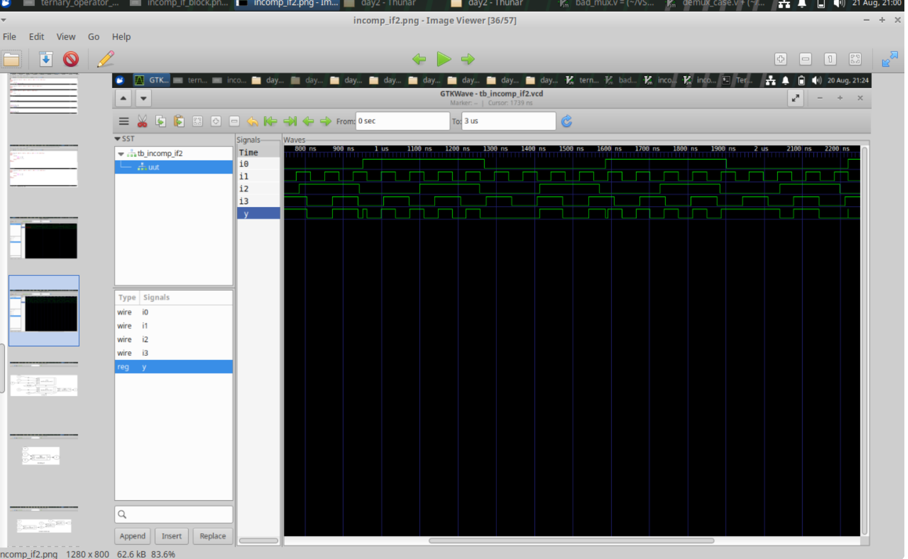
## 9. Complete `case` Description

A complete four-input selector can be written as:

```verilog
always @(*)
begin
    case (sel)
        2'b00: y = i0;
        2'b01: y = i1;
        2'b10: y = i2;
        2'b11: y = i3;
    endcase
end
```

Every possible two-bit selector value has an assignment.
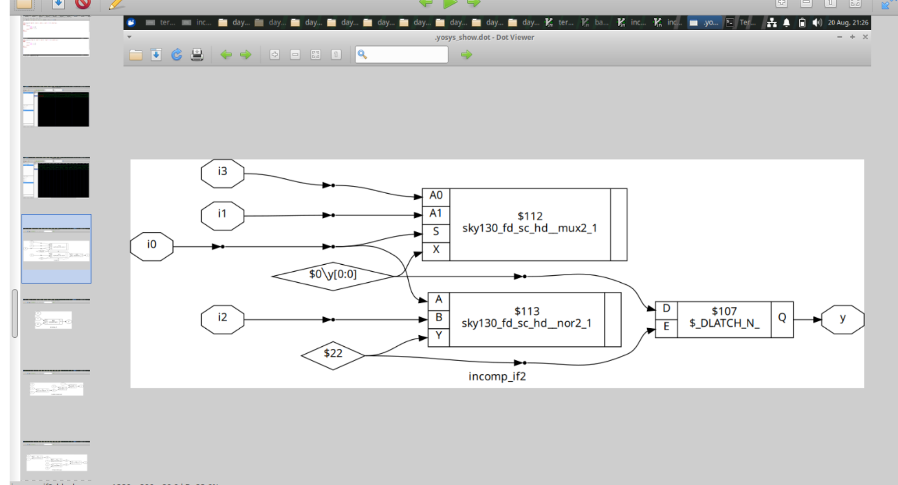
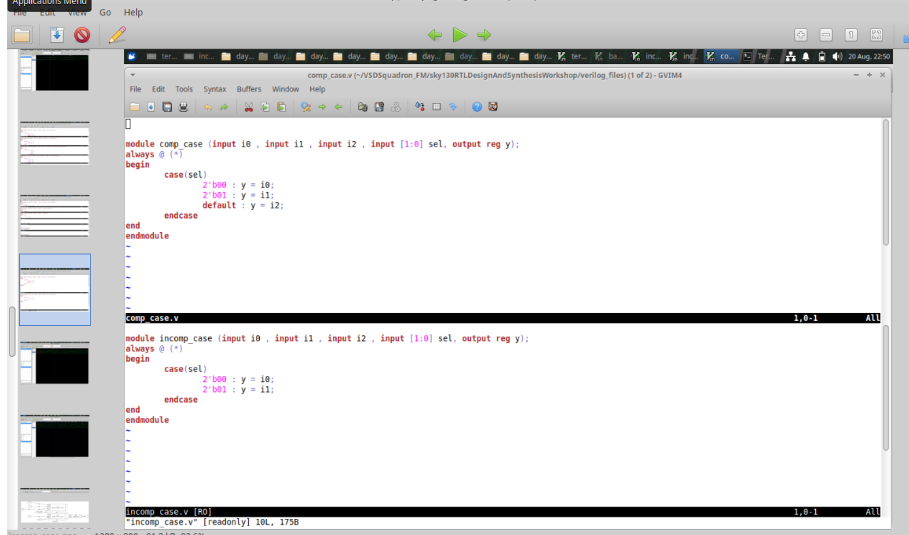
## 10. Using `default`

A default branch is another way to provide defined behavior:

```verilog
always @(*)
begin
    case (sel)
        2'b00: y = i0;
        2'b01: y = i1;
        default: y = i2;
    endcase
end
```

The `default` assignment covers the values not listed explicitly.

## 11. Case-Based MUX

A multiplexer selects one data input.

For a 4:1 MUX:

```text
i0 ----i1 -----i2 ------> [ MUX ] ---> y
i3 -----/
          ^
          |
         sel
```

A `case` statement provides a readable way to express the selection.

## 12. MUX Using Generate

For vector-based repeated selection:

```verilog
genvar i;

generate
    for (i = 0; i < WIDTH; i = i + 1) begin
        assign y[i] = sel ? b[i] : a[i];
    end
endgenerate
```

The loop represents repeated hardware.

Conceptually:

```text
bit 0 -> selector -> y[0]
bit 1 -> selector -> y[1]
bit 2 -> selector -> y[2]
...
```

The elaborated design contains one selection structure for each generated bit.
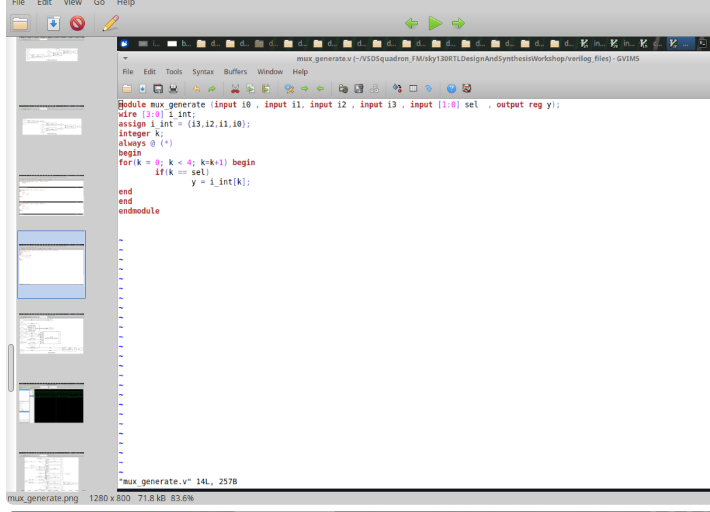
## 13. DEMUX Operation

A demultiplexer routes one input toward one selected output.

```text
                  y0
                   ^
                   |
                   |
d ---> [ DEMUX ]---+--> y1
                   |
                   +--> y2
                   |
                   ...
                   |
                   +--> y7
                         ^
                         |
                        sel
```

Only the selected output receives the active input value.

For example:

```text
d   = 1
sel = 010
```

produces:

```text
y = 00000100
```

with the bit positions interpreted according to the output-vector ordering used in the design.

## 14. DEMUX with `case`

A `case` statement can explicitly assign the selected output.

The implementation should ensure that non-selected outputs also receive defined values to avoid unintended retained values.

A common approach is to provide a default vector value first and then update the selected position.
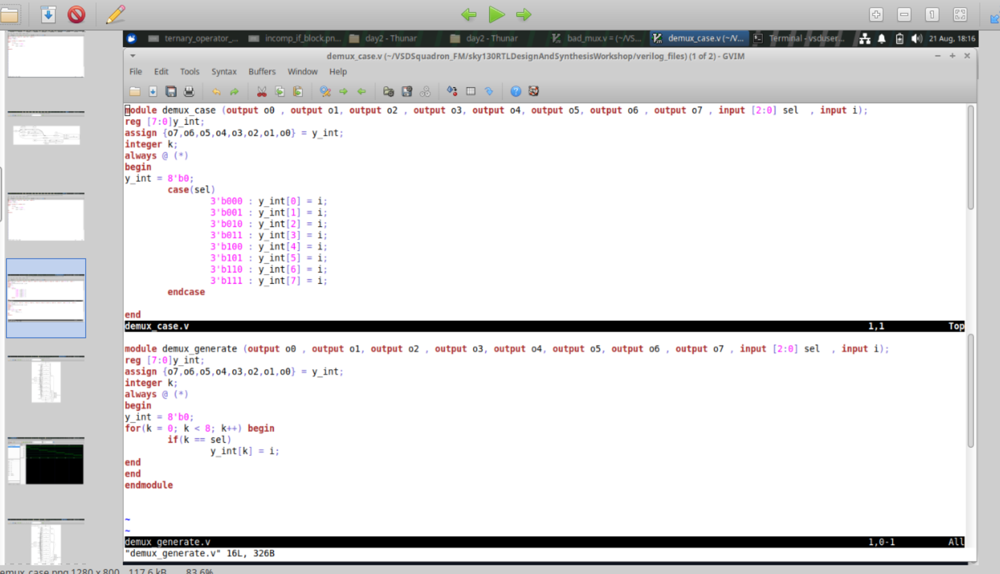
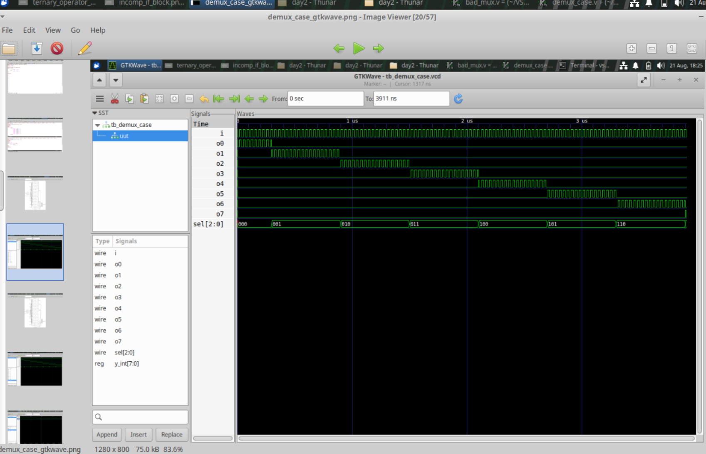
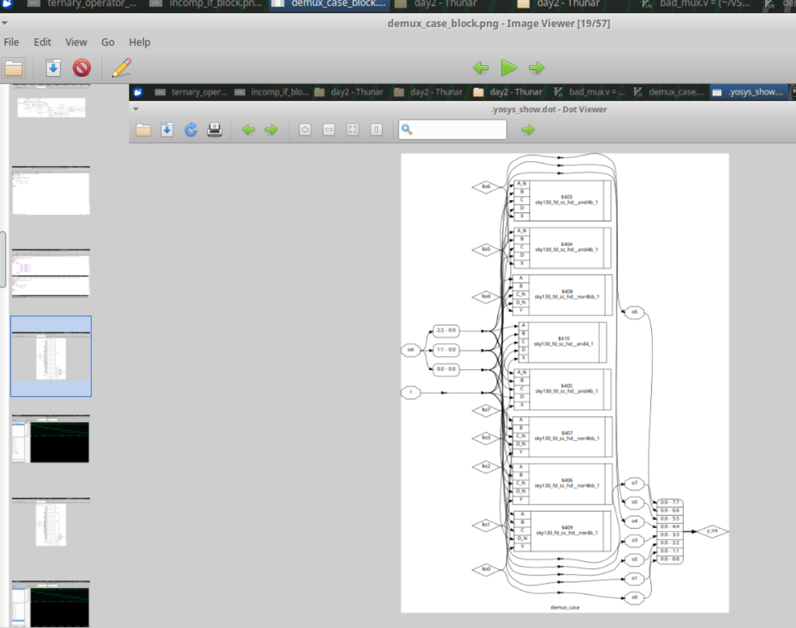
## 15. DEMUX with Generate

Repeated routing logic can also be expressed as:

```verilog
genvar i;

generate
    for (i = 0; i < 8; i = i + 1) begin
        assign y[i] = d & (sel == i);
    end
endgenerate
```

Each generated assignment compares the selector with a particular index.

The repeated pattern is easier to scale than manually writing every branch.
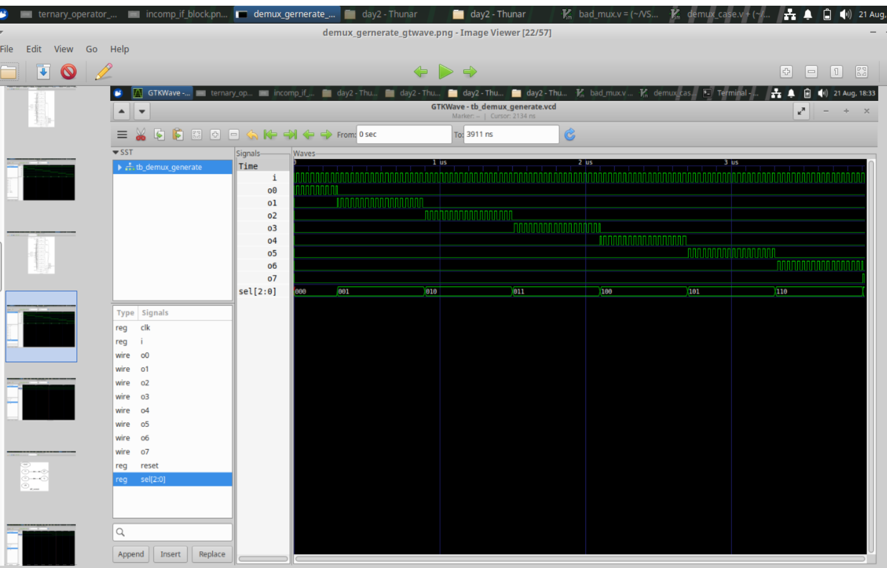
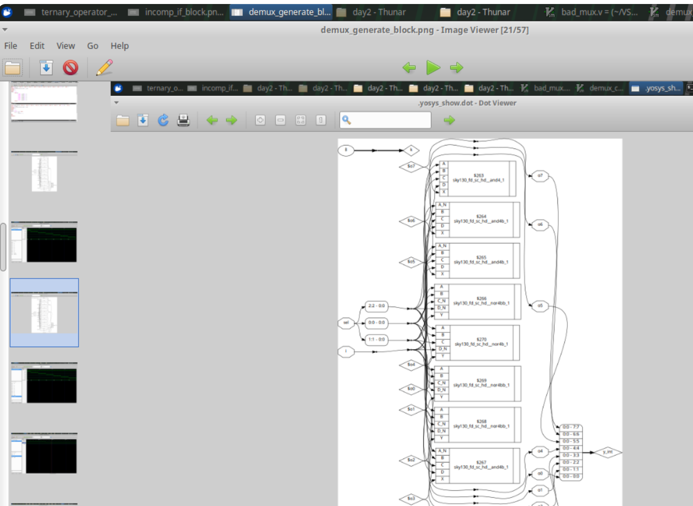
## 16. Generate Versus Case

| Generate | Case |
|---|---|
| describes repeated structures | describes conditional choices |
| useful for scalable designs | useful for selector logic |
| often parameterized | easy to read for small fixed selections |
| expands repeated logic/instances | selects behavior based on conditions |

Both can represent useful hardware depending on the design structure.

## 17. Ripple-Carry Adder

A ripple-carry adder is formed by connecting full-adder stages.

For an eight-bit design:

```text
A[0], B[0] -> FA0 -> SUM[0]
                  |
                  +--> carry[1]

A[1], B[1] -> FA1 -> SUM[1]
                  |
                  +--> carry[2]

A[2], B[2] -> FA2 -> SUM[2]

...

A[7], B[7] -> FA7 -> SUM[7]
                  |
                  +--> final carry
```

The carry output of one stage becomes the carry input of the next.
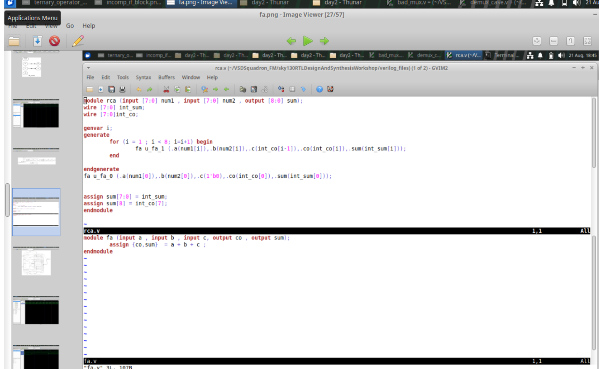
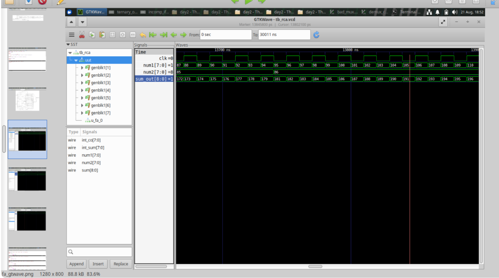
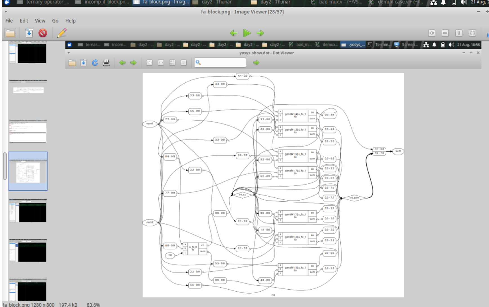


## 19. Why It Is Called Ripple-Carry

The carry travels stage by stage:

```text
FA0
 |
 v carry
FA1
 |
 v carry
FA2
 |
 v
...
 |
 v
FA7
```

The final stages may need to wait for carry information from earlier stages.

This makes the architecture simple, but the carry propagation path can become a timing limitation as the number of bits increases.

## 20. Simulation Strategy

For selector logic, test every meaningful input combination.

For a MUX:

```text
change sel
change selected input
change unselected input
observe y
```

For a DEMUX:

```text
change d
step through selector values
verify selected output
verify inactive outputs
```

For an adder:

```text
apply different operands
check sum
check carry propagation
```

## 21. Synthesis Strategy

After simulation:

1. run synthesis
2. inspect inferred hardware
3. check for unexpected latches
4. inspect generated MUX/DEMUX structures
5. inspect repeated hardware from `generate`
6. verify the adder structure

## 22. Important Coding Guidelines
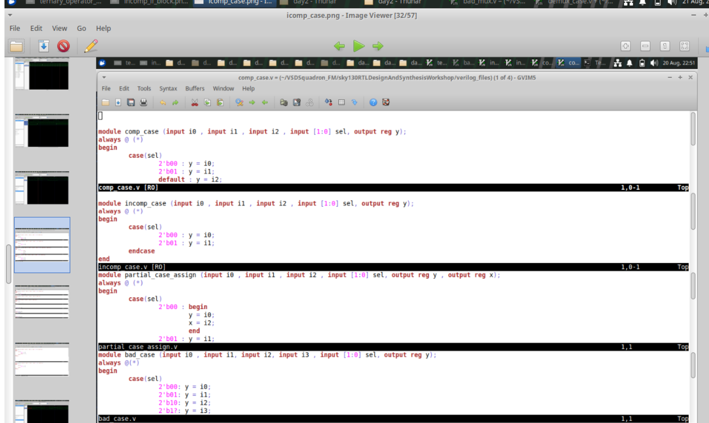
### For combinational blocks

- assign every output in all required conditions
- use `always @(*)` or an appropriate combinational construct
- use complete `if-else` structures where required
- cover `case` values or provide a meaningful default

### For repeated structures

- use `generate` when the pattern is regular
- use parameters when scalability is needed
- verify generated indices and signal widths

### For synthesis review

- do not assume the source structure is preserved
- inspect warnings about inferred latches
- compare the intended behavior with the synthesized implementation
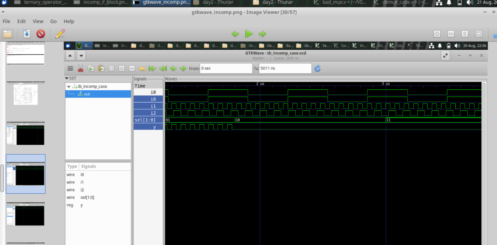
## 23. Module Conclusion

The main lesson of this module is:

```text
Small RTL coding difference
            |
            v
Different inferred behavior
            |
            v
Different synthesized hardware
```

A missing assignment can introduce storage. A complete assignment structure can produce pure combinational logic. A `generate` loop can describe many repeated hardware blocks without manually writing each one.

Clear and complete RTL is therefore important not only for readability, but also for predictable synthesis results.

## 24. Latch Prevention Checklist

Before synthesizing a combinational block, ask:

```text
Does every output get a value?
Are all conditional branches covered?
Does every case value have defined behavior?
Is a default assignment needed?
Is the sensitivity list complete?
```

These questions are simple, but they prevent many common RTL problems.

## 25. Default-First Coding Style

One useful pattern is:

```verilog
always @(*)
begin
    y = 1'b0;

    case (sel)
        2'b00: y = a;
        2'b01: y = b;
        2'b10: y = c;
        2'b11: y = d;
    endcase
end
```

The initial assignment establishes a known value.

Each case then overrides it when appropriate.

This can make the completeness of the combinational description easier to see.

## 26. MUX Truth Table

For a 4:1 MUX:

| sel[1:0] | Output |
|---|---|
| 00 | i0 |
| 01 | i1 |
| 10 | i2 |
| 11 | i3 |

A testbench should exercise all four selector values.

For each selector, change the selected input and verify that the output responds.

## 27. MUX Verification Matrix

A more detailed test can be organized as:

```text
sel=00 -> toggle i0
sel=01 -> toggle i1
sel=10 -> toggle i2
sel=11 -> toggle i3
```

Then change an unselected input and confirm that it does not incorrectly control the output.

This separates selection errors from data-path errors.

## 28. DEMUX Truth Table Concept

For a one-to-four DEMUX:

| sel | Active output |
|---|---|
| 00 | y0 |
| 01 | y1 |
| 10 | y2 |
| 11 | y3 |

If the input is zero, all outputs should normally be inactive.

If the input is one, only the selected output should be active.

## 29. DEMUX Verification

A simple sequence is:

```text
d = 0
test all selectors

d = 1
test selector 00
test selector 01
test selector 10
test selector 11
```

For each selector, inspect the complete output vector rather than only the expected active bit.

## 30. Vector Width Awareness

When using vectors, width consistency matters.

For example:

```verilog
reg [7:0] a;
reg [7:0] b;
wire [7:0] y;
```

The designer should verify that expressions and assignments use compatible widths.

Unexpected width extension or truncation can produce incorrect hardware behavior.

## 31. Generate Block Purpose

A generate construct is elaborated into repeated hardware structure.

It is useful when the same relationship occurs many times.

For example:

```text
bit 0 -> cell
bit 1 -> cell
bit 2 -> cell
bit 3 -> cell
```

Instead of manually writing four instances, a generate loop describes the repetition.

## 32. Generate and Parameters

Generate constructs become especially useful when combined with a parameter:

```verilog
parameter WIDTH = 8;
```

Then a loop can use:

```verilog
for (i = 0; i < WIDTH; i = i + 1)
```

The same RTL structure can support different widths.

## 33. Ripple-Carry Adder Equations

A full adder has:

```text
sum  = a XOR b XOR cin
carry = (a & b) | (b & cin) | (a & cin)
```

The carry generated by one stage becomes the input carry of the next stage.

For an 8-bit RCA:

```text
cin -> FA0 -> FA1 -> FA2 -> FA3 -> FA4 -> FA5 -> FA6 -> FA7 -> cout
```

## 34. RCA Verification Cases

Test at least:

```text
0 + 0
0 + maximum
1 + 1
small + small
maximum + maximum
alternating bit patterns
```

The final carry should also be checked.

For an N-bit unsigned adder, the result may require an additional carry bit beyond the N sum bits.

## 35. Carry Propagation Example

Suppose a lower bit generates a carry:

```text
bit 0
 |
 +--> carry
       |
       v
     bit 1
       |
       +--> carry
             |
             v
           bit 2
```

The carry cannot be finalized at a higher stage until the preceding stage has produced its result.

This is the defining behavior of ripple carry.
